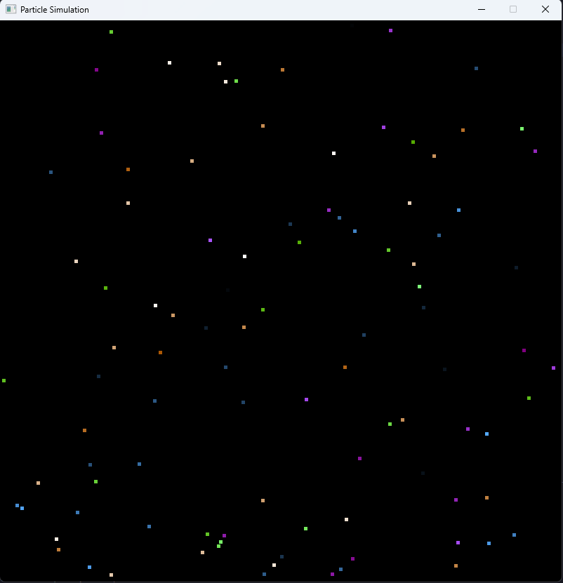

# RustLabs

Repo for the lab work seen in parallel and concurrent programming Y3

# Lab A

I successfully set it up and got it running.

# Lab B

## Q1

Open the folder **first_thread**, in VS Code and run `cargo init` in the **terminal window**.

Open the main Rust file and edit the auto-generated Rust code. Move the print "hello world" to a new function called `my_function`, and then call `my_function` from the main program.

Look at the lecture material for guidance on function syntax.

Now replace the synchronous call to your function with an asynchronous call i.e. create a thread with your function set as its thread Function.
Use the following snippets of Rust as a guide:

```Rust
    std::thread::spawn(move || my_function() );
```

Now expand your code to include a second thread, which calls a second function. Add a print statement to this second function.
Notice how occasionally the output is jumbled. This is a race condition, caused by a thread unsafe print method. We'll address these topics in a future lecture.

Add a sleep method to one of your functions. Sleep is available in the thread library.

Use the following snippet of Rust as a guide:

```Rust
    std::thread::sleep(std::time::Duration::new(5, 0));
```

## A1

I wrote this code:

```Rust

fn main() {
    std::thread::spawn(move || my_function() );
    std::thread::spawn(move || my_function_too() );
}

fn my_function(){
    println!("Hello, world!");
}

fn my_function_too(){
    println!("I'm asleep!");
    std::thread::sleep(std::time::Duration::new(5, 0));
    println!("I'm awake!");
}

```

Sometimes I get this result:

```
PS C:\users\725291\OneDrive - hull.ac.uk\gh\RustLabs\LabB\first_thread> cargo run
    Finished `dev` profile [unoptimized + debuginfo] target(s) in 0.10s
     Running `target\debug\first_thread.exe`
Hello, world!
I'm asleep!
```

Other times I run it, I get this result:

```
PS C:\users\725291\OneDrive - hull.ac.uk\gh\RustLabs\LabB\first_thread> cargo run
    Finished `dev` profile [unoptimized + debuginfo] target(s) in 0.01s
     Running `target\debug\first_thread.exe`
Hello, world!
```

Like the question says, this is an example of a race condition caused by a thread unsafe print method.

## Q2

Open the folder **joining_threads**, in VS Code and run `cargo init` in the **terminal window**.

Copy the code from the previous exercise into `main.rs`

Alter the code to create N threads rather than two threads, where N is a arbitrary number. Use a for loop to achieve this.

Use the following snippets of Rust as a guide, where id is the loop counter and `num_of_threads` the loop limit:

```Rust
    for id in 0..num_of_threads {
        // Add code here
    }
```

Now that you can create an arbitrary number of threads, the next step is to ensure that all threads terminate before the application (the primary thread) terminates. To do this we can use a join method.
The join method blocks until the thread has terminated.

```Rust
t.join();
```

However, in order to use the join method you need to hold a reference to each thread. To do this, use a list to store the threads when they are created. Then iterate over the list to ensure they are all joined.
The following snippets of Rust show the basics of list manipulation.

```Rust
    let mut list_of_threads = vec!();

    list_of_threads.push(t);

    for t in list_of_threads {
        // Add code here
    }
```

Remember Rust variables are immutable (constant) by default. Use the `mut` keyword to make them mutable.

Add a print statement at the end of the main section of code and check that all threads have terminated prior to seeing this print message.

## A2

This is the code I wrote:

```Rust

fn main() {
    println!("Hello, world!");
    let num_of_threads = 5;
    let mut list_of_threads = vec!();
    for id in 0..num_of_threads {
        let t = std::thread::spawn(move || {
            println!("Thread {} is running", id);
        });
        list_of_threads.push(t);
    }

    for t in list_of_threads {
        t.join().unwrap();
    }
    println!("All threads have terminated");
}

```

This code iterates through a for loop, creating a thread each pass-through and adding it to an array of threads. Then, when they are all created, it again iterates through the array, systematically joining them one by one, therefore terminating them.

## Q3

Now that you have the basic framework for creating and joining threads, experiment with giving the threads items of work, as well as altering the number of threads used.

Use **Windows Task Manager** to observe your program running on the CPU.

Info on each core is available on the **Performance** tab, then right click and change graph to **logical processors**

## A3

I altered the code to create 3000 threads:

```Rust

fn main() {
    println!("Hello, world!");
    let num_of_threads = 3000;
    let mut list_of_threads = vec!();
    for id in 0..num_of_threads {
        let t = std::thread::spawn(move || {
            println!("Thread {} is running", id);
        });
        list_of_threads.push(t);
    }

    for t in list_of_threads {
        t.join().unwrap();
    }
    println!("All threads have terminated");
}

```

And it added 3000 threads, although not entirely sequentially:

```
Thread 2963 is running
Thread 2989 is running
Thread 2998 is running
Thread 1673 is running
Thread 1186 is running
Thread 1585 is running
Thread 2977 is running
All threads have terminated
```

When I run this program, I notice some small spikes on the CPU's in task manager. Even on the CPU's that are marked as 'parked'. I assume this is due to the program, though I cannot completely confirm this.

I do not know what it means if a CPU core is 'parked', or entirely why the threads are initialised out of order, or what exactly a 'thread unsafe print method' means, but I am excited to learn.

# Lab C

## Q1

Multiple Rust files can be linked together into a single application with the use of the `mod` statement

Placing `mod my_second_file` in one Rust file, enables that file to use the functions from `my_second_file.rs`

Make use of this functionality to move your thread main function, from the previous lab to its own Rust file. This method requires that you prefix any imported functions with `my_second_file`

```Rust
    my_second_file::run();
```

An alternative method is the `use` command which allows you to drop the requirement to prefix

```Rust
    mod my_second_file;
    use my_second_file::run;
```

## A1

I ended up with this code:

```Rust

mod my_second_file;


fn main() {
    println!("Hello, world!");
    my_second_file::my_function_too();
}

```

```Rust

fn main() {
    std::thread::spawn(move || my_function() );
    std::thread::spawn(move || my_function_too() );
}

fn my_function(){
    println!("Hello, world!");
}

pub fn my_function_too(){
    println!("I'm asleep!");
    std::thread::sleep(std::time::Duration::new(5, 0));
    println!("I'm awake!");
}


```

I followed the brief, making the function public and the results were expected.

## Q2

Open up the folder **Ownership**.

Familiarise yourself with the `struct Person` and the `impl Person`. The `struct` defines the data members for a Person. The `impl` provides the behaviour for a Person.

```Rust
struct Person {
    name: String,
    age: u32
}
```

```Rust
impl Person {
    fn new_default() -> Person {
        Person {
            name: "Joe Bloggs".to_string(),
            age: 25
        }
    }

    fn new(name_param: &str, age_param: u32) -> Person {
        Person {
            name: name_param.to_string(),
            age: age_param
        }
    }
}
```

Note that Rust does not allow overriding of function names, so we have to define unique names for each "constructor".

Comment out `new_default` to avoid the warning as we'll not use this function in the remainder of the exercise.

A basic print function `print_person` has been provided to print out a person's details (this would ordinarily have been included in the `impl` section, but for simplicity its define outside as a basic function)

The main function, creates a `Person` struct and passes it to the `print_person`.

Add a second call to `print_person` within `main`, to print out the details a second time. Why does this not compile?

Hint: Rust has very struct ownership rules.

Now alter the code so that the `print_person` returns the Person object back to the `main`.

It would be very cumbersome to have to pass objects into functions and then to return them, so ownership could be retained. Rust has an alternative, the reference.

Modify `print_person` to use a reference

```Rust
    fn print_person(p: &Person)
```

Rust permits permits shared ownership on an immutable reference. This is called **borrowing**.

You should now be able to use multiple calls to `print_person` without any issue.

Add the function `increment_age` which takes a mutable reference as a parameter.

```Rust
fn increment_age(p: &mut Person) {
    p.age = p.age + 1;
}
```

Call this function once then twice within `main`. You'll also need to make the `Person` object mutable

```Rust
fn main() {
    let mut p1 = Person::new("Jane", 30);

    print_person(&p1);
    print_person(&p1);

    increment_age(&mut p1);
    increment_age(&mut p1);
}

fn print_person(p: & Person) {
    println!("{} is {} years old", p.name, p.age);
}

fn increment_age(p: &mut Person) {
    p.age = p.age + 1;
}
```

Rust has a rule that states you cannot have more than one mutable reference to the same object, neither can you have even a single mutable reference to an object that has one or more immutable references.

So why does the code you have created, work?

The answer is that Rust is able to determine if a reference (whether mutable or immutable) is still being used.

Now lets see if we can cause the borrowing to fail. We'll add some explicit immutable and mutable references to our code.

```Rust
fn main() {
    let mut p1 = Person::new("Jane", 30);

    let r1 = & p1;
    let r2 = & p1;

    print_person(r1);
    print_person(r2);

    let r3 = &mut p1;

    increment_age(r3);
}
```

`r1`, `r2` and `r3` are references

This should compile and execute just fine.

Now move one of the calls of `print_person` below the call to `increment_age`.

The code should no longer compile.

Rust has seen that we are trying to use a mutable reference to an object for which there is still an active immutable reference.

You can find more details here: <https://doc.rust-lang.org/book/ch04-02-references-and-borrowing.html>

## A2

This was my final code:

```Rust


struct Person {
    name: String,
    age: u32
}

impl Person {

    fn new(name_param: &str, age_param: u32) -> Person {
        Person {
            name: name_param.to_string(),
            age: age_param
        }
    }
}

fn main() {
    let mut p1 = Person::new("Jane", 30);

    let r1 = & p1;
    let r2 = & p1;

    print_person(r1);
    print_person(r2);

    let r3 = &mut p1;

    increment_age(r3);

    print_person(r3);

    increment_age(r3);

    print_person(&r3);
}

fn print_person(p: &Person) {
    println!("{} is {} years old", p.name, p.age);
}

fn increment_age(p: &mut Person) {
    p.age = p.age + 1;
}

```

I greatened my knowledge of the borrow checker in Rust and how it deals with references and where to use them. When I tried to iniutialy add a second call to print_person within main to print out the details a second time. This was the error I was getting in console:

```

PS D:\Files\Documents\AProjects\Rust\ParallelAndConcurrentProgrammingLabs\LabC\ownership> cargo run
   Compiling ownership v0.1.0 (D:\Files\Documents\AProjects\Rust\ParallelAndConcurrentProgrammingLabs\LabC\ownership)
error[E0382]: use of moved value: `p1`
  --> src\main.rs:21:18
   |
18 |     let p1 = Person::new("Jane", 30);
   |         -- move occurs because `p1` has type `Person`, which does not implement the `Copy` trait
19 |
20 |     print_person(p1);
   |                  -- value moved here
21 |     print_person(p1);
   |                  ^^ value used here after move
   |
note: consider changing this parameter type in function `print_person` to borrow instead if owning the value isn't necessary
  --> src\main.rs:24:20
   |
24 | fn print_person(p: Person) {
   |    ------------    ^^^^^^ this parameter takes ownership of the value
   |    |
   |    in this function
note: if `Person` implemented `Clone`, you could clone the value
  --> src\main.rs:2:1
   |
2  | struct Person {
   | ^^^^^^^^^^^^^ consider implementing `Clone` for this type
...
20 |     print_person(p1);
   |                  -- you could clone this value

For more information about this error, try `rustc --explain E0382`.
error: could not compile `ownership` (bin "ownership") due to 1 previous error

```

I now know the cause of these errors through this lab, as well as how to solve them. I was able to use multiple calls to print_person without an issue.

## Q3

In the lecture you were introduced to a Rust class called `SharedData`. This class is used for sharing of data across two or more threads

```Rust
pub struct SharedData {
    value: u32
}

impl SharedData {
    pub fn new() -> SharedData {
        SharedData {
            value: 0
        }
    }

    pub fn update(&mut self) {
        let local_value = self.value;
        std::thread::sleep(std::time::Duration::new(1,0));
        self.value = local_value + 1;
    }

    pub fn print(&self) {
        println!("SharedData: value = {}", self.value)
    }
}
```

Familiarise yourself with how Rust implements:

- the constructor i.e. `new`
- methods
- data members
- the self object (The equivalent to C#'s `this` keyword)

The main program illustrates how to use the `SharedData` struct

Notice how placing `SharedData` in a separate Rust file, hides all the components and we have to use the `pub` keyword to make them visible to `main`

Create a new thread function which takes `SharedData` as a parameter and then calls the `update` and `print` functions.

Now run your new thread function in a thread, as per the previous Lab

Once this is working, try and move the `print` function from your thread function to the main program. You will notice that this causes ownership issues.

These cannot be resolved by the ownership techniques we learnt earlier. To solve this particular problem will require some new Rust techniques e.g. `arc` or the asynchronous reference counters. We'll investigate this in a future lab.

However, the reason why Rust does not allow the sharing of SharedData between main and your thread function is too eliminate the possibility of a race condition. The Rust language was created in response to a requirement for a very efficient language that was safe to use for multi-threaded problems.

## A3

This was the final code I ended up with:

```Rust

mod shared_data;
use shared_data::SharedData;

fn main() {

    let shared_data = SharedData::new();
    shared_data.print();
}

fn update_print(shared_data: &SharedData) {
    shared_data.update();
    shared_data.print();
}

```

```Rust


pub struct SharedData {
    value: u32
}

impl SharedData {
    pub fn new() -> SharedData {
        SharedData {
            value: 0
        }
    }

    pub fn update(&mut self) {
        let local_value = self.value;
        std::thread::sleep(std::time::Duration::new(1,0));
        self.value = local_value + 1;
    }

    pub fn print(&self) {
        println!("SharedData: value = {}", self.value)
    }

}

```

I have greatened my knowlege on how classes work, and how they correlate over to Rust from C++. I am excited to find out how to fix this error that was expected to happen from the brief:

```

error[E0596]: cannot borrow `*shared_data` as mutable, as it is behind a `&` reference
  --> src\main.rs:11:5
   |
11 |     shared_data.update();
   |     ^^^^^^^^^^^ `shared_data` is a `&` reference, so the data it refers to cannot be borrowed as mutable
   |
help: consider changing this to be a mutable reference
   |
10 | fn update_print(shared_data: &mut SharedData) {
   |                               +++

For more information about this error, try `rustc --explain E0596`.
error: could not compile `shared_data` (bin "shared_data") due to 1 previous error

```

## Lab C Reflection

Despite already having some knowledge in Rust before this due to personal projects over the years. I appreciate these labs for giving me time to reflect over what I know and even gain a greater understanding of them. I appreciate the parrallels that are drawn between C++ and Rust, highlighting where they differ from eachother in certain areas. I am excited to see how this knowledge will fit in when it comes to multi-threading. Despite still being a novice, I feel better about my Rust ability after the Lab.

# Lab D

## Q1

In the lecture and Lab C we looked at Rust class called `SharedData`. This class is used for sharing of data across two or more threads

```Rust
pub struct SharedData {
    value: u32
}

impl SharedData {
    pub fn new() -> SharedData {
        SharedData {
            value: 0
        }
    }

    pub fn update(&mut self) {
        let local_value = self.value;
        std::thread::sleep(std::time::Duration::new(1,0));
        self.value = local_value + 1;
    }

    pub fn print(&self) {
        println!("SharedData: value = {}", self.value)
    }
}
```

In Lab C you created a new thread function which takes `SharedData` as a parameter and calls the `update` and `print` functions.

When you tried to move the `print` function from your thread function to the main program. You would have experienced ownership issues.

These cannot be resolved by the ownership techniques we learnt earlier. To solve this particular problem will require some new Rust techniques. This lab begins by exploring one of these, namely: reference counters.

Create a new Rust folder and add the following code to main.rs

```Rust
struct Aircraft<'a> {
    name: String,
    engines: Vec<&'a Engine>,
}

impl Aircraft<'_> {
    pub fn new(name_param: &str) -> Aircraft {
        Aircraft {
            name: name_param.to_string(),
            engines: Vec::new()
        }
    }
}

struct Engine {
    name: String,
}

impl Engine {
    pub fn new(name_param: &str) -> Engine {
        Engine {
            name: name_param.to_string(),
        }
    }
}

fn main() {
    let engine1 = Engine::new( "General Electric F404" );
    let engine2 = Engine::new( "General Electric F404" );
    let mut f18 = Aircraft::new( "F-18" );

    f18.engines.push (&engine1);
    f18.engines.push (&engine2);

    println! ("Aircraft: {} has a {} and {} ", f18.name, f18.engines[0].name, f18.engines[1].name );
}
```

This code creates two structs `Aircraft` and `Engine`. `Aircraft` contains a vector of references that can hold a number of engines.

In `main` we create two `Engine` objects and an `Aircraft` object and the then link them together.

Examine the code and make sure you understand the syntax.

Note: The strange `'a` notation attached to the reference is called a lifetime parameter. It allows the compiler to determine whether all references are going to stay "alive" at least as long as the "parent". In our example, it ensure that the engines will exist at least as long as the aircraft. What would happen if this was not the case?

Try to expand the code to include a data member in `Engine` that links to the `Aircraft`.

The limitation with the current code is that due to ownership restrictions it is not possible to link the `Aircraft` to an `Engine`

## A1

Adding an aircraft data member to our engine struct like this throws an error:

```Rust

struct Engine {
    name: String,
    aircraft: &Aircraft,
}

```

```

PS D:\Files\Documents\AProjects\Rust\ParallelAndConcurrentProgrammingLabs\LabD\Aircraft> cargo run
   Compiling Aircraft v0.1.0 (D:\Files\Documents\AProjects\Rust\ParallelAndConcurrentProgrammingLabs\LabD\Aircraft)
error[E0106]: missing lifetime specifier
  --> src\main.rs:17:15
   |
17 |     aircraft: &Aircraft,
   |               ^ expected named lifetime parameter
   |
help: consider introducing a named lifetime parameter
   |
15 ~ struct Engine<'a> {
16 |     name: String,
17 ~     aircraft: &'a Aircraft,
   |

error[E0106]: missing lifetime specifier
  --> src\main.rs:17:16
   |
17 |     aircraft: &Aircraft,
   |                ^^^^^^^^ expected named lifetime parameter
   |
help: consider introducing a named lifetime parameter
   |
15 ~ struct Engine<'a> {
16 |     name: String,
17 ~     aircraft: &Aircraft<'a>,
   |

error[E0063]: missing field `aircraft` in initializer of `Engine`
  --> src\main.rs:22:9
   |
22 |         Engine {
   |         ^^^^^^ missing `aircraft`

Some errors have detailed explanations: E0063, E0106.
For more information about an error, try `rustc --explain E0063`.
error: could not compile `Aircraft` (bin "Aircraft") due to 3 previous errors

```

This is because we get into a circular reference situation, wherein Aircraft refers to Engine which refers back to Aircraft. Because of Rust's ownership rules, this does not compile. To solve this, we need to implement reference counting.

## Q2

Let's rewrite the code and use reference counters.

Create a new Rust folder and add the following code to main.rs

```Rust
use std::rc::Rc;

struct Aircraft {
    name: String,
    engines: Vec<Rc<Engine>>,
}

impl Aircraft {
    pub fn new(name_param: &str) -> Aircraft {
        Aircraft {
            name: name_param.to_string(),
            engines: Vec::new()
        }
    }
}

struct Engine {
    name: String,
}

impl Engine {
    pub fn new(name_param: &str) -> Engine {
        Engine {
            name: name_param.to_string(),
        }
    }
}

fn main() {
    let engine1 = Rc::new(Engine::new( "General Electric F404" ));
    let engine2 = Rc::new(Engine::new( "General Electric F404" ));

    let mut f18 = Aircraft::new( "F-18" );

    f18.engines.push (engine1.clone());
    f18.engines.push (engine2.clone());

    println! ("Aircraft: {} has a {} and {}", f18.name, f18.engines[0].name , f18.engines[1].name );
    println! ("Engine: {} ", engine1.name );
    println! ("Engine: {} ", engine2.name );
}
```

This code uses `RC` (or reference counters) to act as smart pointers to the objects. We have removed the need to use references and lifetime parameters. Arguable this code is also now easier to understand.

Examine the code.

Use your knowledge of the Rust ownership model to explain what is happening with the reference counters and why we do not need to pass them as references.

Remove the `clone()` method from this line

```Rust
f18.engines.push (engine1.clone());
```

Can you explain why this program now fails to build?

Add a new boolean data member `requires_service` to `Engine`.

Then add a new method `service(&mut self)` to `Engine`. This method will just set the `requires_service` data member to `false`.

Now test your code with by adding the following to `main()`

```Rust
    let mut engine3 = Engine::new( "General Electric F404" );
    engine3.service();
```

You should be able to service engine3.

You will get a build error if you try and service engine2, which is accessed through an `rc`.

Again, using your knowledge of the Rust ownership module can you explain why the error is occurring?

This is a limitation of reference counters. We'll look to overcome this limitation in future labs.

## A2

Through using RC, a kind of smart pointer, it enables us to have the circular connection we wanted in the previous question. RC keeps track of how many references exist to a value, and when the last reference is dropped, the value is cleaned up.

If we remove the `clone` function from both of these lines, leaving us with this:

```Rust

f18.engines.push (engine1);
f18.engines.push (engine2);

```

We get this compiler error:

```

PS D:\Files\Documents\AProjects\Rust\ParallelAndConcurrentProgrammingLabs\LabD\Aircraft> cargo run
   Compiling Aircraft v0.1.0 (D:\Files\Documents\AProjects\Rust\ParallelAndConcurrentProgrammingLabs\LabD\Aircraft)
error[E0382]: borrow of moved value: `engine1`
    --> src\main.rs:39:30
     |
30   |     let engine1 = Rc::new(Engine::new( "General Electric F404" ));
     |         ------- move occurs because `engine1` has type `Rc<Engine>`, which does not implement the `Copy` trait
...
35   |     f18.engines.push (engine1);
     |                       ------- value moved here
...
39   |     println! ("Engine: {} ", engine1.name );
     |                              ^^^^^^^^^^^^ value borrowed here after move
     |
     = note: borrow occurs due to deref coercion to `Engine`
note: deref defined here
    --> C:\Users\Jayd\.rustup\toolchains\stable-x86_64-pc-windows-msvc\lib/rustlib/src/rust\library\alloc\src\rc.rs:2224:5
     |
2224 |     type Target = T;
     |     ^^^^^^^^^^^
help: clone the value to increment its reference count
     |
35   |     f18.engines.push (engine1.clone());
     |                              ++++++++

error[E0382]: borrow of moved value: `engine2`
    --> src\main.rs:40:30
     |
31   |     let engine2 = Rc::new(Engine::new( "General Electric F404" ));
     |         ------- move occurs because `engine2` has type `Rc<Engine>`, which does not implement the `Copy` trait
...
36   |     f18.engines.push (engine2);
     |                       ------- value moved here
...
40   |     println! ("Engine: {} ", engine2.name );
     |                              ^^^^^^^^^^^^ value borrowed here after move
     |
     = note: borrow occurs due to deref coercion to `Engine`
note: deref defined here
    --> C:\Users\Jayd\.rustup\toolchains\stable-x86_64-pc-windows-msvc\lib/rustlib/src/rust\library\alloc\src\rc.rs:2224:5
     |
2224 |     type Target = T;
     |     ^^^^^^^^^^^
help: clone the value to increment its reference count
     |
36   |     f18.engines.push (engine2.clone());
     |                              ++++++++

For more information about this error, try `rustc --explain E0382`.
error: could not compile `Aircraft` (bin "Aircraft") due to 2 previous errors

```

The purpose of the `clone()` function here is not to clone the particular Engine, but rather to create a new reference to the same engine. When we remove it, `push` takes ownership of the Engine, therefore not allowing us to print the Engine's name. That's why we get the error `` error[E0382]: borrow of moved value: `engine2` ``.

If we add in the functionality of Engines having a 'service', we end up with this code.

```Rust

struct Engine {
    name: String,
    requires_service: bool,
}

impl Engine {
    pub fn new(name_param: &str) -> Engine {
        Engine {
            name: name_param.to_string(),
            requires_service: true,
        }
    }
    pub fn service(&mut self) {
        self.requires_service = false;
    }
}

fn main() {
    let engine1 = Rc::new(Engine::new( "General Electric F404" ));
    let engine2 = Rc::new(Engine::new( "General Electric F404" ));

    let mut engine3 = Engine::new( "General Electric F404" );
    engine3.service();

    let mut f18 = Aircraft::new( "F-18" );

    f18.engines.push (engine1.clone());
    f18.engines.push (engine2.clone());

    println! ("Aircraft: {} has a {} and {}", f18.name, f18.engines[0].name , f18.engines[1].name );
    println! ("Engine: {} ", engine1.name );
    println! ("Engine: {} ", engine2.name );

    println! ("Engine: {} requires service: {}", engine3.name, engine3.requires_service );

    engine2.service();
}

```

However, this throws an error.

```

PS D:\Files\Documents\AProjects\Rust\ParallelAndConcurrentProgrammingLabs\LabD\Aircraft> cargo run
   Compiling Aircraft v0.1.0 (D:\Files\Documents\AProjects\Rust\ParallelAndConcurrentProgrammingLabs\LabD\Aircraft)
error[E0596]: cannot borrow data in an `Rc` as mutable
  --> src\main.rs:52:5
   |
52 |     engine2.service();
   |     ^^^^^^^ cannot borrow as mutable
   |
   = help: trait `DerefMut` is required to modify through a dereference, but it is not implemented for `Rc<Engine>`

For more information about this error, try `rustc --explain E0596`.
error: could not compile `Aircraft` (bin "Aircraft") due to 1 previous error

```

'engine3' is able to be serviced fine, but 'engine2' cannot. This is because RC only provides immutable access to its contents, it is designed for cases where you need shared ownership but not shared mutability.

## Lab D Reflection

Through this lab I have become more familiar with the 'RustTM' way of doing things. Despite having some previous Rust experience, the lab provided me with a nicely formatted way of understanding the more complex way data structures can interact in Rust. I understand that at this early stage of learning, the main focus here is not necessarily to give big coding tasks, but more bitesized examples on the 'why' of Rust programming, something that I do appreciate. Although I am still largely inexperienced, I am excited to have gotten more in-tune with Rust's infamous ownership and borrowing system. I am hyped to see where Refcel or Mutex fit into this. I assume we will be using Mutex in the next lab because this is all building up to being able to make multi-threaded programs.

# Lab E

## Q1

Open the **unsafe_print** folder in Visual Studio Code.

Build and run the code, and ensure that it works.
Examine the code to become familiar with the syntax.

The output should appear jumbled, as multiple threads compete for the single print function. This is called a race condition. You might have to run it several times to see the jumble.

Make a copy of the **unsafe_print** folder and name it **safe_print**.

The remainder of **Q1** will work in the **safe_print** folder.

Implement the thread safe printing as described during the lectures.

You will need to use both `Mutex` and `Arc` to create a critical section within the `print_lots()`

Create the `Mutex` and `Arc` within `main()`, to enable them to be shared with all the threads.

Ensure that the result of `print_lots()` no longer demonstrates a race condition.

What happens to your code if you fail to release the mutex?

Are you able to verify this in your code?

What happens if you raise an exception within the critical section?

Extend your code to verify your answer

## A1

Interestly, there are two solutions to this issue. One is the actual solution with Mutex and Arc (the one that we are meant to use to demonstrate thread safety), and the other is using `stdout().lock()` which is specific for this problem. I have written code that demonstrates both of these solutions.

```Rust

use std::sync::{Arc, Mutex};
use std::thread;
use std::io::{self, Write};

//* THERE ARE TWO METHODS TO SOLVE THIS */
//* 1. use mutex with arc for thread-safe sharing using standard print! macros */
//* 2. use stdout().lock() for thread-safe sharing using write! and writeln! macros */

//* the mutex approach is better because its general-purpose and therefore the point of this lab */
//* the stdout().lock() approach is more memory efficient (no need for extra allocations) but less general-purpose */
//* realistically you are using mutex */

fn main() {
    println!("=== Approach 1: Using Arc<Mutex<()>> ===");

    let num_of_threads = 4;
    let mut array_of_threads = vec!();

    let mutex = Mutex::new(());
    let arc_mutex = Arc::new(mutex);

    for id in 0..num_of_threads {
        let thread_mutex = Arc::clone(&arc_mutex);

        array_of_threads.push(thread::spawn(move || {
            print_lots(id, thread_mutex)
        }));
    }

    for t in array_of_threads {
        t.join().expect("Thread join failure");
    }

    println!("\n=== Approach 2: Using stdout().lock() ===");

    let mut array_of_threads = vec!();

    for id in 0..num_of_threads {
        array_of_threads.push(thread::spawn(move || {
            print_lots_alt(id)
        }));
    }

    for t in array_of_threads {
        t.join().expect("Thread join failure");
    }
}

//* mutex approach */
fn print_lots(id: u32, lock: Arc<Mutex<()>>) {
    // acquire the lock - this blocks until the lock is available
    let _guard = lock.lock().unwrap();

    // while the _guard exists, we have exclusive access to stdout
    println!("Begin [{}]", id);
    for _i in 0..100 {
        print!("{} ", id);
    }
    println!("\nEnd [{}]", id);

    // _guard automatically drops here when it goes out of scope
    // which releases the lock for other threads
}

//* stdout().lock() approach */
fn print_lots_alt(id: u32) {
    // get a handle to stdout
    let stdout = io::stdout();
    // lock stdout for exclusive access
    let mut handle = stdout.lock();

    // use write! and writeln! with the locked handle
    writeln!(handle, "Begin [{}]", id).unwrap();
    for _i in 0..100 {
        write!(handle, "{} ", id).unwrap();
    }
    writeln!(handle, "\nEnd [{}]", id).unwrap();

    // lock is automatically released when handle goes out of scope
}

```

```

PS D:\Files\Documents\AProjects\Rust\ParallelAndConcurrentProgrammingLabs\LabE\safe_print> cargo run
   Compiling locks v0.1.0 (D:\Files\Documents\AProjects\Rust\ParallelAndConcurrentProgrammingLabs\LabE\safe_print)
    Finished `dev` profile [unoptimized + debuginfo] target(s) in 0.54s
     Running `target\debug\locks.exe`
=== Approach 1: Using Arc<Mutex<()>> ===
Begin [0]
0 0 0 0 0 0 0 0 0 0 0 0 0 0 0 0 0 0 0 0 0 0 0 0 0 0 0 0 0 0 0 0 0 0 0 0 0 0 0 0 0 0 0 0 0 0 0 0 0 0 0 0 0 0 0 0 0 0 0 0 0 0 0 0 0 0 0 0 0 0 0 0 0 0 0 0 0 0 0 0 0 0 0 0 0 0 0 0 0 0 0 0 0 0 0 0 0 0 0 0
End [0]
Begin [1]
1 1 1 1 1 1 1 1 1 1 1 1 1 1 1 1 1 1 1 1 1 1 1 1 1 1 1 1 1 1 1 1 1 1 1 1 1 1 1 1 1 1 1 1 1 1 1 1 1 1 1 1 1 1 1 1 1 1 1 1 1 1 1 1 1 1 1 1 1 1 1 1 1 1 1 1 1 1 1 1 1 1 1 1 1 1 1 1 1 1 1 1 1 1 1 1 1 1 1 1
End [1]
Begin [2]
2 2 2 2 2 2 2 2 2 2 2 2 2 2 2 2 2 2 2 2 2 2 2 2 2 2 2 2 2 2 2 2 2 2 2 2 2 2 2 2 2 2 2 2 2 2 2 2 2 2 2 2 2 2 2 2 2 2 2 2 2 2 2 2 2 2 2 2 2 2 2 2 2 2 2 2 2 2 2 2 2 2 2 2 2 2 2 2 2 2 2 2 2 2 2 2 2 2 2 2
End [2]
Begin [3]
3 3 3 3 3 3 3 3 3 3 3 3 3 3 3 3 3 3 3 3 3 3 3 3 3 3 3 3 3 3 3 3 3 3 3 3 3 3 3 3 3 3 3 3 3 3 3 3 3 3 3 3 3 3 3 3 3 3 3 3 3 3 3 3 3 3 3 3 3 3 3 3 3 3 3 3 3 3 3 3 3 3 3 3 3 3 3 3 3 3 3 3 3 3 3 3 3 3 3 3
End [3]

=== Approach 2: Using stdout().lock() ===
Begin [0]
0 0 0 0 0 0 0 0 0 0 0 0 0 0 0 0 0 0 0 0 0 0 0 0 0 0 0 0 0 0 0 0 0 0 0 0 0 0 0 0 0 0 0 0 0 0 0 0 0 0 0 0 0 0 0 0 0 0 0 0 0 0 0 0 0 0 0 0 0 0 0 0 0 0 0 0 0 0 0 0 0 0 0 0 0 0 0 0 0 0 0 0 0 0 0 0 0 0 0 0
End [0]
Begin [2]
2 2 2 2 2 2 2 2 2 2 2 2 2 2 2 2 2 2 2 2 2 2 2 2 2 2 2 2 2 2 2 2 2 2 2 2 2 2 2 2 2 2 2 2 2 2 2 2 2 2 2 2 2 2 2 2 2 2 2 2 2 2 2 2 2 2 2 2 2 2 2 2 2 2 2 2 2 2 2 2 2 2 2 2 2 2 2 2 2 2 2 2 2 2 2 2 2 2 2 2
End [2]
Begin [1]
1 1 1 1 1 1 1 1 1 1 1 1 1 1 1 1 1 1 1 1 1 1 1 1 1 1 1 1 1 1 1 1 1 1 1 1 1 1 1 1 1 1 1 1 1 1 1 1 1 1 1 1 1 1 1 1 1 1 1 1 1 1 1 1 1 1 1 1 1 1 1 1 1 1 1 1 1 1 1 1 1 1 1 1 1 1 1 1 1 1 1 1 1 1 1 1 1 1 1 1
End [1]
Begin [3]
3 3 3 3 3 3 3 3 3 3 3 3 3 3 3 3 3 3 3 3 3 3 3 3 3 3 3 3 3 3 3 3 3 3 3 3 3 3 3 3 3 3 3 3 3 3 3 3 3 3 3 3 3 3 3 3 3 3 3 3 3 3 3 3 3 3 3 3 3 3 3 3 3 3 3 3 3 3 3 3 3 3 3 3 3 3 3 3 3 3 3 3 3 3 3 3 3 3 3 3
End [3]

```

We create a Mutex with an empty tuple (unit), this will control access to the shared resource of `stdout()`. We use Arc to share this Mutex across all of the threads. Arc is a friendly little smart pointer that allows use to pseudo-bypass the strict ownership rules of Rust, it keeps track of how many references to a value exist, incrementing the count when you clone it, and decreasing it when a reference is dropped. When the count reaches zero, it destroys the underlying value. Through Arc, we distribute a reference to Mutex across all the threads, when a thread calls the `print_lots()` function, it tries to get the lock from Mutex, hanging until it does. When a thread acquires the lock, it will continue to execute its code until its done, therefore automatically dropping the lock for the next thread. When a thread is done executing the `print_lots()` function, it gets joined, which Arc notices this and therefore removes the reference for Mutex from it as a form of garbage collection. This culminates with each thread allowing exclusive access to `stdout()` before another thread gets it, meaning we have nice sequential printing for each thread. The order is arbitrary, its whatever thread gets to the lock first.

Because each thread will wait to recieve the lock, if one thread for whatever reason does not drop the lock after it is done with it, we end up in a deadlock situation, halting progress of the entire program.

Because Rust is built with multi-threading in mind, `stdout().lock` exists, providing a built-in locking mechanism specifically for printing to console. This solution is a lot less verbose, with no need for Mutex or Arc, but the idea is still the same. When the function gets called, it locks `stdout()` until it is done writing, of which then it releases the lock for the next thread. We use the `write!` macro here instead of the more convenient `print!` macro because we need a more low-level macro that does not automatically handle locking and unlocking. This approach is more idiomatic for a simple CLI Rust program, but is not the point of this lab, as it is to introduce Mutex and Arc. In a real-world example, this method I assume would be preffered.

## Q2

Open the **triangles** folder in Visual Studio Code.

This is a Rust program that uses OpenGL to render some simple triangles to the scene.

Build and run the code to ensure it works.

Although this is a relatively small piece of code by OpenGL standards, it does use some advanced Rust language constructs. Don't panic, you are not expected to understand all of this code, even if you have previously studied graphics.

We'll look at the code in a little more detail in future lectures.

For this lab, focus on the code between the comments:

```Rust
// Begin render loop
```

and

```Rust
// End render loop
```

The code clears the screen, and then individually positions ten triangles on the display. It uses the counter `delta_t` to animate the triangles.

Update the code to move the triangles around the screen in a more chaotic pattern.

The following code can be used to generate a floating point random number.

```Rust
let x = rand::random::<f32>();
```

Use this code to help create a more chaotic movement of triangles.

### Note

As part of the final large lab exercise, you will be required to create a large parallel simulation to be run on both the CPU and GPU. You will be using this OpenGL framework to help visualize the results. It is therefore important that you complete this lab exercise so that you start becoming familiar with the OpenGL / Rust interface.

## A2

I simply created two random floats and multiplied the x and y positions by them for each triangle.

```Rust

 let x = rand::random::<f32>();
 let y = rand::random::<f32>();

 // Calculate the position of the triangle
 let pos_x : f32 = delta_t + ((i as f32) * 0.1 * x);
 let pos_y : f32 = delta_t + ((i as f32) * 0.1 * y);

```

This created more chaotic movement in the triangles. You could take this a step further by having two random floats for each axis, or by altering the delta time with a random variable, but that is not the point of this lab (I think).

## Lab E Reflection

This lab was really interesting and allowed me to explore Mutex and Arc with a relatively simple but realistic example. I have definitely improved my programming knowledge in Rust and am excited to explore the potential that this knowledge brings me. I am definitely the type of person that likes to sweat over saving milliseconds so it has been very fun to see the benefits and disadvantages of multi-threading. I am happy to have found two methods for solving the first question too, and taking the time to understand them both has increased my confidence with Rust. Familiarising myself with OpenGL Rust code has also been interesting, especially because I have prior experience with webGL. I am hyped for this big end of year assignment, especially the Rust section. The Cuda section not so much because I have an AMD card.

# Lab F

## Q1

Open the empty `particles` project.

Define the following `struct`:

- `Particle` that contains `x` and `y` data members.
- `ParticleSystem` that contains a vector of `Particles`.

Implement a `new` function for each of the data structures.

A suggested starting point would be 100 particles limited in position to a 10 x 10 enclosure.

**Hint**: You may find constants useful for defining these parameters e.g.

```rust
const NUM_OF_THREADS: usize = 4;
```

Now add a function to `ParticleSystem` that moves each particle a random distance within the enclosure
You may find the following function useful (It returns a random floating point number in the range 0 to 1):

```rust
    rand::random::<f32>()
```

Remember to add `rand="*"` as a dependency in the `.toml` file

Add appropriate test code to ensure that the particle positions are both initialised correctly and updated when the move function is called.

Now add a function to `ParticleSystem` that contains a loop that repeatedly calls your move function, for approximately 10 seconds.

By default you have been building and running your code in debug mode. Try switching to release mode, using

```system
cargo build --release
cargo run --release
```

Finally add the following macro on the line above your `particle` struct.

```rust
#[derive(Debug, Copy, Clone)]
pub struct Particle {
```

This macro instructs the compiler to implement a debug, copy and clone trait for your new struct.

## A1

I ended up with this code:

```Rust

//* Simple Particle Sim */
const NUM_PARTICLES: usize = 100;
const ENCLOSURE_SIZE: f32 = 10.0;

//* Particle */
#[derive(Debug, Copy, Clone)]
pub struct Particle {
    x: f32,
    y: f32,
}

impl Particle {
    fn new(x: f32, y: f32) -> Self {
        Particle { x, y }
    }
}

//* ParticleSystem */
struct ParticleSystem {
    particles: Vec<Particle>,
}

impl ParticleSystem {
    fn new() -> Self {
        let mut particles = Vec::with_capacity(NUM_PARTICLES);

        for i in 0..NUM_PARTICLES {
            let row = i / 10;
            let col = i % 10;

            let x = (col as f32) * ENCLOSURE_SIZE / 10.0 + 0.5;
            let y = (row as f32) * ENCLOSURE_SIZE / 10.0 + 0.5;

            particles.push(Particle::new(x, y));
        }

        ParticleSystem { particles }
    }

    fn move_particles(&mut self) {
        for particle in &mut self.particles {
            let dx = (rand::random::<f32>() - 0.5) * 0.2;
            let dy = (rand::random::<f32>() - 0.5) * 0.2;

            particle.x = f32::min(f32::max(particle.x + dx, 0.0), ENCLOSURE_SIZE);
            particle.y = f32::min(f32::max(particle.y + dy, 0.0), ENCLOSURE_SIZE);
        }
    }

    fn run_simulation(&mut self) {
        use std::time::{Duration, Instant};

        let simulation_duration = Duration::from_secs(10);
        let start_time = Instant::now();

        while start_time.elapsed() < simulation_duration {
            self.move_particles();
        }
    }
}

//* Main */
fn main() {
    let mut particle_system = ParticleSystem::new();

    println!("Initial state - showing first 5 particles:");
    for i in 0..5 {
        println!("Particle {}: ({:.2}, {:.2})",
                 i,
                 particle_system.particles[i].x,
                 particle_system.particles[i].y);
    }

    particle_system.move_particles();

    println!("\nAfter movement - showing first 5 particles:");
    for i in 0..5 {
        println!("Particle {}: ({:.2}, {:.2})",
                 i,
                 particle_system.particles[i].x,
                 particle_system.particles[i].y);
    }

    println!("\nRunning simulation for 10 seconds...");
    particle_system.run_simulation();
    println!("Simulation complete");

    println!("\nFinal state - showing first 5 particles:");
    for i in 0..5 {
        println!("Particle {}: ({:.2}, {:.2})",
                 i,
                 particle_system.particles[i].x,
                 particle_system.particles[i].y);
    }


    let avg_x = particle_system.particles.iter().map(|p| p.x).sum::<f32>() / NUM_PARTICLES as f32;
    let avg_y = particle_system.particles.iter().map(|p| p.y).sum::<f32>() / NUM_PARTICLES as f32;

    println!("\nAverage position of all particles: ({:.2}, {:.2})", avg_x, avg_y);
}

```

There are two objects, Particle and ParticleSystem. A ParticleSystem is an array of Particle objects, and when it gets initialised, it creates a set number of Particles in a set enclosure size. The Particles are placed in a grid-like pattern uniformly. In this case Particles 0-9 are placed in the first row (y=0.5) with x values from 0.5 to 9.5, Particles 10-19 are in the second row (y=1.5) with x values from 0.5 to 9.5. This distribution is intental as if they all started from a common point, we would just see clustering, which is not a good visualisation of how each Particle moves here.

There are also two other functions for ParticleSystem `move_particles()` and `run_simulation()`. `move_particles()` iterates through the Particles in the ParticleSystem, generate two random displacement floats for the X and Y axis, and moves it. We opt for `let dx = (rand::random::<f32>() - 0.5) * 0.2;` here instead of just generating a float because with this method the values generated are between -0.1 and 0.1 rather than 0-1.

The second function associated with ParticleSystem is `run_simulation()`. This will start a 10 second timer, and while that timer is running, it will continue to call the `move_particles()` function. Meaning after 10 seconds, all of the Particles will be displaced by a great amount.

In the main function, we show the first 5 Particles in the particle system before any displacement. Then we move one 'step', and print the first 5 Particles positions again. Then we run the simulation and print the first 5 Particles new positions. Once that is done, we can show the average position of all Particles. Here is the output:

```
Initial state - showing first 5 particles:
Particle 0: (0.50, 0.50)
Particle 1: (1.50, 0.50)
Particle 2: (2.50, 0.50)
Particle 3: (3.50, 0.50)
Particle 4: (4.50, 0.50)

After movement - showing first 5 particles:
Particle 0: (0.49, 0.44)
Particle 1: (1.56, 0.52)
Particle 2: (2.52, 0.49)
Particle 3: (3.43, 0.41)
Particle 4: (4.45, 0.53)

Running simulation for 10 seconds...
Simulation complete

Final state - showing first 5 particles:
Particle 0: (1.27, 8.44)
Particle 1: (0.55, 7.30)
Particle 2: (1.16, 9.00)
Particle 3: (9.46, 4.74)
Particle 4: (8.90, 0.23)

Average position of all particles: (4.68, 4.85)
```

The average position being near the center of the enclosure size is a good sign.

### Better VIsualising

This part is largely uninportant to the core of the lab and therefore can be skipped, this is for my own sake.

I then decided I wanted a more visual representation because it is all good and well printing out the positions but what good is a particle simulation without you being able to see the particles dance around. Using the lightweight Rust Crate 'minifb' (minimal framebuffer) we can create a window and draw pixels to it. We create a buffer to draw to and iterate through each particle, writing it to the buffer, with each pixel being represented as a 32-bit unsigned integer in ARGB. Our rendering loop updates with the buffer and renders new frames at 60fps, running until the simulation is finished (10 seconds in this case) or until we press ESC.

```Rust

extern crate minifb;
extern crate rand;

use minifb::{Key, Window, WindowOptions};
use std::time::{Duration, Instant};

const NUM_PARTICLES: usize = 100;
const ENCLOSURE_SIZE: f32 = 10.0;
const WINDOW_WIDTH: usize = 800;
const WINDOW_HEIGHT: usize = 800;
const PARTICLE_SIZE: usize = 5;

#[derive(Debug, Copy, Clone)]
pub struct Particle {
    x: f32,
    y: f32,
}

impl Particle {
    fn new(x: f32, y: f32) -> Self {
        Particle { x, y }
    }
}

struct ParticleSystem {
    particles: Vec<Particle>,
}

impl ParticleSystem {
    fn new() -> Self {
        let mut particles = Vec::with_capacity(NUM_PARTICLES);

        for i in 0..NUM_PARTICLES {
            let row = i / 10;
            let col = i % 10;

            let x = (col as f32) * ENCLOSURE_SIZE / 10.0 + 0.5;
            let y = (row as f32) * ENCLOSURE_SIZE / 10.0 + 0.5;

            particles.push(Particle::new(x, y));
        }

        ParticleSystem { particles }
    }

    fn move_particles(&mut self) {
        for particle in &mut self.particles {
            let dx = (rand::random::<f32>() - 0.5) * 0.2;
            let dy = (rand::random::<f32>() - 0.5) * 0.2;

            particle.x = f32::min(f32::max(particle.x + dx, 0.0), ENCLOSURE_SIZE);
            particle.y = f32::min(f32::max(particle.y + dy, 0.0), ENCLOSURE_SIZE);
        }
    }

    fn run_simulation(&mut self) {
        let simulation_duration = Duration::from_secs(10);
        let start_time = Instant::now();

        while start_time.elapsed() < simulation_duration {
            self.move_particles();
        }
    }

    fn run_simulation_with_visualization(&mut self) {
        let mut window = Window::new(
            "Particle Simulation",
            WINDOW_WIDTH,
            WINDOW_HEIGHT,
            WindowOptions::default(),
        )
        .unwrap_or_else(|e| {
            panic!("{}", e);
        });

        let mut buffer: Vec<u32> = vec![0; WINDOW_WIDTH * WINDOW_HEIGHT];

        let start_time = Instant::now();
        let simulation_duration = Duration::from_secs(10);

        let mut last_render_time = Instant::now();
        let render_interval = Duration::from_millis(16);

        while window.is_open() && !window.is_key_down(Key::Escape) && start_time.elapsed() < simulation_duration {
            self.move_particles();

            if last_render_time.elapsed() >= render_interval {
                for i in buffer.iter_mut() {
                    *i = 0;
                }

                for (i, particle) in self.particles.iter().enumerate() {
                    let px = (particle.x / ENCLOSURE_SIZE * WINDOW_WIDTH as f32) as usize;
                    let py = (particle.y / ENCLOSURE_SIZE * WINDOW_HEIGHT as f32) as usize;

                    let color = 0xFF000000 |
                                (((i as u32 * 50) % 256) << 16) |
                                (((i as u32 * 100) % 256) << 8) |
                                ((i as u32 * 150) % 256);

                    for dy in 0..PARTICLE_SIZE {
                        for dx in 0..PARTICLE_SIZE {
                            let draw_x = px.saturating_add(dx).min(WINDOW_WIDTH - 1);
                            let draw_y = py.saturating_add(dy).min(WINDOW_HEIGHT - 1);
                            let idx = draw_y * WINDOW_WIDTH + draw_x;
                            if idx < buffer.len() {
                                buffer[idx] = color;
                            }
                        }
                    }
                }

                window.update_with_buffer(&buffer, WINDOW_WIDTH, WINDOW_HEIGHT).unwrap();
                last_render_time = Instant::now();
            }
        }
    }
}

fn main() {
    let mut particle_system = ParticleSystem::new();

    println!("Initial state - showing first 5 particles:");
    for i in 0..5 {
        println!("Particle {}: ({:.2}, {:.2})",
                 i,
                 particle_system.particles[i].x,
                 particle_system.particles[i].y);
    }

    particle_system.move_particles();

    println!("\nAfter movement - showing first 5 particles:");
    for i in 0..5 {
        println!("Particle {}: ({:.2}, {:.2})",
                 i,
                 particle_system.particles[i].x,
                 particle_system.particles[i].y);
    }

    println!("\nRunning simulation with visualization for 10 seconds...");
    particle_system.run_simulation_with_visualization();
    println!("Simulation complete");

    println!("\nFinal state - showing first 5 particles:");
    for i in 0..5 {
        println!("Particle {}: ({:.2}, {:.2})",
                 i,
                 particle_system.particles[i].x,
                 particle_system.particles[i].y);
    }

    let avg_x = particle_system.particles.iter().map(|p| p.x).sum::<f32>() / NUM_PARTICLES as f32;
    let avg_y = particle_system.particles.iter().map(|p| p.y).sum::<f32>() / NUM_PARTICLES as f32;

    println!("\nAverage position of all particles: ({:.2}, {:.2})", avg_x, avg_y);
}

```

Here is a screenshot of the simulation window:



I will not be doing this for the next question as I am not in the mood to give it a go right now.

## Q2

Make a copy of your `particle` project and name it `particle_threaded`

**IMPORTANT** please read all of this question before starting on the implementation.

The aim of this exercise is to spread the work of your move function across a number of threads. How to sharing mutable data across threads requires careful thought and the solution is very much application dependent.

In our case we have two options:

1. Allow all threads access to the list of particles, and then lock each particle as it is updated.
2. Allocate each thread a different chunk of the list of particle, avoiding the need for locks.

The second option is the suggested approach as it is far more efficient.

Add a `thread_main` function to your project. This should call your move function, implemented in the previous exercise. A suggested prototype for the function is:

```rust
fn pub thread_main (list: &mut [Particle], enclosure_size: f32);
```

The next problem is that we need to split the list of particles into sub lists, one for each thread. This can be achieve in a number of different ways. However the greater problem is one of ownership. If this sub-list is moved into a thread, as we have done previously, then we will lose ownership of it and we'll not be able to use the sub-list within our print_all function.

The thread controls we have used so far in the module, create a thread and then allow it to run until the join. But we have seen that the compiler does not recognise the join as the end of the thread's ownership. What we need is another thread control mechanism that allows us to create a thread that only exists with a defined scope, recognised by the compiler. To do this we use a `scoped_threadpool`, which as the name suggests allows us to force threads to exist only within a specific scope.

Add `scoped_threadpool="*"` to your `.toml`

The example below starts n threads that execute only in the scoped block of code. At the end of the block, they are implicitly joined and then go out of scope. This then allows us to regain ownership of any borrows.

```rust
let mut pool = scoped_threadpool::Pool::new(NUM_OF_THREADS as u32);

// Limit the scope of the reads to this section of code
pool.scoped(|scope| {
    for i in 0..PARTICLES_PER_THREAD {
        scope.execute(move || thread_main());
    }
});
// Implicit join here, where all threads go out of scope.
```

To split up our list of particles into sub-lists we can make use of the `chunk` functionality that splits a list into a number of mutable sub-lists

```rust
for slice in list.chunks_mut(NUMBER_OF_CHUNKS) {
    // slice is a mutable sub-list of list.
}
```

Use the `chunk` and `scope_threadpool` functionality to implement you solution to the problem of sharing the particle simulation load.

Once you have working code, test it in both release and debug mode.

What do you notice about the performance of the threaded versus non-threaded code ?

## A2

I took my code from A1 (pre-visualisation) and butchered it for multi-threading. Here is the full code:

```Rust

const NUM_PARTICLES: usize = 100;
const ENCLOSURE_SIZE: f32 = 10.0;
const NUM_OF_THREADS: usize = 4;

#[derive(Debug, Copy, Clone)]
pub struct Particle {
    x: f32,
    y: f32,
}

impl Particle {
    fn new(x: f32, y: f32) -> Self {
        Particle { x, y }
    }
}

struct ParticleSystem {
    particles: Vec<Particle>,
}

impl ParticleSystem {
    fn new() -> Self {
        let mut particles = Vec::with_capacity(NUM_PARTICLES);

        for i in 0..NUM_PARTICLES {
            let row = i / 10;
            let col = i % 10;

            let x = (col as f32) * ENCLOSURE_SIZE / 10.0 + 0.5;
            let y = (row as f32) * ENCLOSURE_SIZE / 10.0 + 0.5;

            particles.push(Particle::new(x, y));
        }

        ParticleSystem { particles }
    }

    fn move_particles(&mut self) {
        for particle in &mut self.particles {
            let dx = (rand::random::<f32>() - 0.5) * 0.2;
            let dy = (rand::random::<f32>() - 0.5) * 0.2;

            particle.x = f32::min(f32::max(particle.x + dx, 0.0), ENCLOSURE_SIZE);
            particle.y = f32::min(f32::max(particle.y + dy, 0.0), ENCLOSURE_SIZE);
        }
    }

    fn move_particles_threaded(&mut self) {
        let mut pool = scoped_threadpool::Pool::new(NUM_OF_THREADS as u32);

        let chunk_size = (NUM_PARTICLES + NUM_OF_THREADS - 1) / NUM_OF_THREADS;

        pool.scoped(|scope| {
            for chunk in self.particles.chunks_mut(chunk_size) {
                scope.execute(move || {
                    thread_main(chunk, ENCLOSURE_SIZE);
                });
            }
        });
    }

    fn run_simulation(&mut self, threaded: bool) {
        use std::time::{Duration, Instant};

        let simulation_duration = Duration::from_secs(10);
        let start_time = Instant::now();

        while start_time.elapsed() < simulation_duration {
            if threaded {
                self.move_particles_threaded();
            } else {
                self.move_particles();
            }
        }

        let elapsed = start_time.elapsed();
        println!("Simulation took {:?}", elapsed);
    }
}

pub fn thread_main(list: &mut [Particle], enclosure_size: f32) {
    for particle in list {
        let dx = (rand::random::<f32>() - 0.5) * 0.2;
        let dy = (rand::random::<f32>() - 0.5) * 0.2;

        particle.x = f32::min(f32::max(particle.x + dx, 0.0), enclosure_size);
        particle.y = f32::min(f32::max(particle.y + dy, 0.0), enclosure_size);
    }
}

fn main() {
    let mut particle_system = ParticleSystem::new();

    println!("Initial state - showing first 5 particles:");
    for i in 0..5 {
        println!("Particle {}: ({:.2}, {:.2})",
                 i,
                 particle_system.particles[i].x,
                 particle_system.particles[i].y);
    }

    println!("\nRunning multi-threaded simulation for 10 seconds...");
    particle_system.run_simulation(true);
    println!("Multi-threaded simulation complete");

    println!("\nFinal state - showing first 5 particles:");
    for i in 0..5 {
        println!("Particle {}: ({:.2}, {:.2})",
                 i,
                 particle_system.particles[i].x,
                 particle_system.particles[i].y);
    }

    let avg_x = particle_system.particles.iter().map(|p| p.x).sum::<f32>() / NUM_PARTICLES as f32;
    let avg_y = particle_system.particles.iter().map(|p| p.y).sum::<f32>() / NUM_PARTICLES as f32;

    println!("\nAverage position of all particles: ({:.2}, {:.2})", avg_x, avg_y);
}

```

The new `thread_main()` function now handles a subset of particles, again just displacing them like before but doing it only for a list of particles. This function accepts a mutable slice of particles and the enclosure size, serving as the core logic here for the program. We call this new function with another new funcion, `move_particles_threaded()`, which creates a thread pool based on the thread count const and divides them into neat little chunks.

We use a scoped thread pool here as it is localisaed to a specific block of code, this makes life easier because it automatically handles joining the threads at the end of the scope. To calculate the chunk size, `(NUM_PARTICLES + NUM_OF_THREADS - 1) / NUM_OF_THREADS` esnures that particles are evenly distrivuted among threads, with the last thread potentially handling fewer particles if need be.

To compare the efficacy of both approaches, we could implement a step counter so we can see how many times all of the particles were displaced over the 10 seconds:

```Rust

 fn run_simulation(&mut self, threaded: bool) -> usize {
    use std::time::{Duration, Instant};

    let simulation_duration = Duration::from_secs(10);
    let start_time = Instant::now();
    let mut steps = 0;

    while start_time.elapsed() < simulation_duration {
        if threaded {
            self.move_particles_threaded();
        } else {
            self.move_particles();
        }
        steps += 1;
    }

    let elapsed = start_time.elapsed();
    println!("Simulation completed {} steps in {:?}", steps, elapsed);
    steps
}
}

pub fn thread_main(list: &mut [Particle], enclosure_size: f32) {
    for particle in list {
        let dx = (rand::random::<f32>() - 0.5) * 0.2;
        let dy = (rand::random::<f32>() - 0.5) * 0.2;

        particle.x = f32::min(f32::max(particle.x + dx, 0.0), enclosure_size);
        particle.y = f32::min(f32::max(particle.y + dy, 0.0), enclosure_size);
    }
}

fn main() {
    // Run non-threaded version
    let mut particle_system = ParticleSystem::new();

    println!("Initial state (non-threaded) - showing first 5 particles:");
    for i in 0..5 {
        println!("Particle {}: ({:.2}, {:.2})",
                 i,
                 particle_system.particles[i].x,
                 particle_system.particles[i].y);
    }

    println!("\nRunning non-threaded simulation for 10 seconds...");
    let non_threaded_steps = particle_system.run_simulation(false);

    println!("\nFinal state (non-threaded) - showing first 5 particles:");
    for i in 0..5 {
        println!("Particle {}: ({:.2}, {:.2})",
                 i,
                 particle_system.particles[i].x,
                 particle_system.particles[i].y);
    }

    let avg_x = particle_system.particles.iter().map(|p| p.x).sum::<f32>() / NUM_PARTICLES as f32;
    let avg_y = particle_system.particles.iter().map(|p| p.y).sum::<f32>() / NUM_PARTICLES as f32;
    println!("\nAverage position of all particles (non-threaded): ({:.2}, {:.2})", avg_x, avg_y);

    // Run threaded version
    let mut particle_system_threaded = ParticleSystem::new();

    println!("\nInitial state (threaded) - showing first 5 particles:");
    for i in 0..5 {
        println!("Particle {}: ({:.2}, {:.2})",
                 i,
                 particle_system_threaded.particles[i].x,
                 particle_system_threaded.particles[i].y);
    }

    println!("\nRunning multi-threaded simulation for 10 seconds...");
    let threaded_steps = particle_system_threaded.run_simulation(true);

    println!("\nFinal state (threaded) - showing first 5 particles:");
    for i in 0..5 {
        println!("Particle {}: ({:.2}, {:.2})",
                 i,
                 particle_system_threaded.particles[i].x,
                 particle_system_threaded.particles[i].y);
    }

    let avg_x = particle_system_threaded.particles.iter().map(|p| p.x).sum::<f32>() / NUM_PARTICLES as f32;
    let avg_y = particle_system_threaded.particles.iter().map(|p| p.y).sum::<f32>() / NUM_PARTICLES as f32;
    println!("\nAverage position of all particles (threaded): ({:.2}, {:.2})", avg_x, avg_y);

    // Performance comparison
    println!("\nPerformance comparison:");
    println!("- Non-threaded: {} steps", non_threaded_steps);
    println!("- Threaded: {} steps", threaded_steps);
    println!("- Speedup: {:.2}x", threaded_steps as f32 / non_threaded_steps as f32);
}

```

And here is the output:

```

Initial state (non-threaded) - showing first 5 particles:
Particle 0: (0.50, 0.50)
Particle 1: (1.50, 0.50)
Particle 2: (2.50, 0.50)
Particle 3: (3.50, 0.50)
Particle 4: (4.50, 0.50)

Running non-threaded simulation for 10 seconds...
Simulation completed 17979412 steps in 10.0000002s

Final state (non-threaded) - showing first 5 particles:
Particle 0: (4.93, 8.46)
Particle 1: (1.28, 4.37)
Particle 2: (4.68, 6.14)
Particle 3: (4.42, 4.68)
Particle 4: (7.03, 9.37)

Average position of all particles (non-threaded): (5.58, 5.37)

Initial state (threaded) - showing first 5 particles:
Particle 0: (0.50, 0.50)
Particle 1: (1.50, 0.50)
Particle 2: (2.50, 0.50)
Particle 3: (3.50, 0.50)
Particle 4: (4.50, 0.50)

Running multi-threaded simulation for 10 seconds...
Simulation completed 69262 steps in 10.0000831s

Final state (threaded) - showing first 5 particles:
Particle 0: (5.65, 0.07)
Particle 1: (3.99, 7.13)
Particle 2: (4.88, 8.38)
Particle 3: (9.70, 6.55)
Particle 4: (1.49, 7.13)

Average position of all particles (threaded): (5.12, 5.40)

Performance comparison:
- Non-threaded: 17979412 steps
- Threaded: 69262 steps
- Speedup: 0.00x

```

As you can see, the threaded version is actually performing much worse (17979412 > 69262). This was a bit of a shock but I believe I have an explanation. Becaause the program creates an entire new thread pool for every single step of the simulation, there is a lot of overhead because thread creation is expensive. This thread pool creation is not actually that suitable for the workload, as moving 100 particles is a very small task, meaning the overhead of creating these threads, dividing work, and coordinating them exceeds the benefit of parallel execution. I do not doubt whatsoever that if the actual program here was more computationally expensive, threading would be exponentionally more beneficial as usually it excels with large data sets rather than small quick operations.

## Lab F Reflection

I enjoyed this lab because it serves as a good introduction to simulations in rust, and how threading can benefit/disadvantage the program. I liked working with thread pools as they just seem so much more intuitive what we have previously learnt with manually creating threads and controlling locking. I can definitely see this becoming a great asset when we move onto the more computationally expensive programs, as it is much less of a headache to set up and wrap my head around than before. I am still a bit baffled by the fact my threaded version was around 260x slower than my first approach, but I believe my explanation makes sense so I hope I have not missed anything or done something wrong. I am excited to see how thread pooling is expanded upon in bigger programs.

# Lab G

## Q1

Make a copy of your `particle_threaded` project and name it `colliding_particle_threaded`

Create a new function `collide()` that checks if a particle collides with (or is very close to) another particle.

**Hint:** In terms of good object-oriented design, the `collide()` should be placed within the `Particle` class

Create a new pool of threads with a new thread main. Within this thread main, you'll need to iterate over the list of particles calling your `collide()` function for each pair of particles.

Now add a counter to count the number of collision that occur in your simulation. Initially, this counter can be local to the new thread main. Print this counter before the thread terminates.
In the next exercise we'll replace this counter with an atomic.

Limit the number of collision threads to one, until you are confident that your code is executing correctly.

You should now have two sets of threads (collision and moves) that are accessing the same set of data. One reading the other writing.

- Is locking required in your solution to prevent race conditions?
- Are there any other race conditions that can occur in your code?
- Are there any optimisations you can make to your code?

## A1

Following on from last week, I was able to copy my code and refine it for this lab. I removed the non-threaded code along with the comparison between them and stripped it down to its fundamentals. From there, I added a `collide()` function to my Particle.

```Rust
fn collide(&self, other: &Particle) -> bool {
        let dx = self.x - other.x;
        let dy = self.y - other.y;
        let dsqr = dx * dx + dy * dy;

        dsqr < 0.01
    }
```

I opted to spare the square root for very slight performance gains, as this would be running many, many times a second. This function returns true when two particles are within a certain threshold of eachother. From here, we can make a `check_collisions_threaded();` function. This function creates a thread pool and iterates through every particle, checking it against every other particle. Because of the nested threads, no pair of particles would be checked twice. If it finds a collision when checking (`particle.collide()` returns true), it increments a counter. If at the end of the step the counter is above 0, it sends out a print statement of the amount of collisions at that particular step.

```Rust
fn check_collisions_threaded(&self, step: usize) -> usize {
        let mut total_collisions = 0;
        let mut pool = scoped_threadpool::Pool::new(1);

        pool.scoped(|scope| {
            let particles = &self.particles;
            let collisions_ref = &mut total_collisions;

            scope.execute(move || {
                let mut step_collisions = 0;

                for i in 0..particles.len() {
                    for j in (i+1)..particles.len() {
                        if particles[i].collide(&particles[j]) {
                            step_collisions += 1;
                        }
                    }
                }

                *collisions_ref = step_collisions;
                if step_collisions > 0 {
                    println!("Step: {} - Collisions: {}", step, step_collisions,);
                }
            });
        });

        total_collisions
    }
```

Because we return an integer from `check_collisions_threaded()`, for every step we run the function in our `run_simulation()`, we can sum up the total collisions after all the steps and print them at the end. Doing this also avoids using the atomic datatype which is not allowed in this section. This is the final code and the result for 100 steps so the console does not get too messy.

```Rust
// Lab G - Threaded Colliding Particle Sim
// Jayden Holdsworth - 15/03/2025
use rand;
use scoped_threadpool;
use std::time::Instant;

const NUM_PARTICLES: usize = 100;
const ENCLOSURE_SIZE: f32 = 10.0;
const NUM_MOVEMENT_THREADS: usize = 4;
const SIMULATION_STEPS: usize = 100;

//* Particle Class */
#[derive(Debug, Copy, Clone)]
pub struct Particle {
    x: f32,
    y: f32,
}

impl Particle {
    fn new(x: f32, y: f32) -> Self {
        Particle { x, y }
    }

    fn collide(&self, other: &Particle) -> bool {
        let dx = self.x - other.x;
        let dy = self.y - other.y;
        let dsqr = dx * dx + dy * dy;

        dsqr < 0.01
    }
}

//* Particle System Class */
struct ParticleSystem {
    particles: Vec<Particle>,
}

impl ParticleSystem {
    fn new() -> Self {
        let mut particles = Vec::with_capacity(NUM_PARTICLES);
        // particles are created in a grid to avoid initial collisions
        for i in 0..NUM_PARTICLES {
            let row = i / 10;
            let col = i % 10;

            let x = (col as f32) * ENCLOSURE_SIZE / 10.0 + 0.5;
            let y = (row as f32) * ENCLOSURE_SIZE / 10.0 + 0.5;

            particles.push(Particle::new(x, y));
        }

        ParticleSystem {
            particles,
        }
    }

    fn move_particles_threaded(&mut self) {
        let mut pool = scoped_threadpool::Pool::new(NUM_MOVEMENT_THREADS as u32);

        let chunk_size = (NUM_PARTICLES + NUM_MOVEMENT_THREADS - 1) / NUM_MOVEMENT_THREADS;

        pool.scoped(|scope| {
            for chunk in self.particles.chunks_mut(chunk_size) {
                scope.execute(move || {
                    for particle in chunk {
                        let dx = (rand::random::<f32>() - 0.5) * 0.2;
                        let dy = (rand::random::<f32>() - 0.5) * 0.2;

                        particle.x = f32::min(f32::max(particle.x + dx, 0.0), ENCLOSURE_SIZE);
                        particle.y = f32::min(f32::max(particle.y + dy, 0.0), ENCLOSURE_SIZE);
                    }
                });
            }
        });
    }

    // checks for collisions between particles on a separate thread
    fn check_collisions_threaded(&self, step: usize) -> usize {
        let mut total_collisions = 0;
        let mut pool = scoped_threadpool::Pool::new(1);

        pool.scoped(|scope| {
            let particles = &self.particles;
            let collisions_ref = &mut total_collisions;

            scope.execute(move || {
                let mut step_collisions = 0;

                for i in 0..particles.len() {
                    for j in (i+1)..particles.len() {
                        if particles[i].collide(&particles[j]) {
                            step_collisions += 1;
                        }
                    }
                }

                *collisions_ref = step_collisions;
                if step_collisions > 0 {
                    println!("Step: {} - Collisions: {}", step, step_collisions,);
                }
            });
        });

        total_collisions
    }

    fn run_simulation(&mut self, steps: usize) {
        println!("\nRunning simulation for {} steps...", steps);
        let timer = Instant::now();
        let mut total_collisions = 0;

        for step in 1..=steps {
            self.move_particles_threaded();

            total_collisions += self.check_collisions_threaded(step);

            if step % 100 == 0 {
                println!("Completed {} steps", step);
            }
        }

        let elapsed = timer.elapsed();
        println!("Simulation complete. Total collisions: {}", total_collisions);
        println!("Simulation took: {}.{:03} seconds", elapsed.as_secs(), elapsed.subsec_millis());
    }
}

//* Main */
fn main() {
    let mut particle_system = ParticleSystem::new();

    println!("Initial state - showing first 5 particles:");
    for i in 0..5 {
        println!("Particle {}: ({:.2}, {:.2})",
                 i,
                 particle_system.particles[i].x,
                 particle_system.particles[i].y);
    }

    particle_system.run_simulation(SIMULATION_STEPS);

    println!("\nFinal state - showing first 5 particles:");
    for i in 0..5 {
        println!("Particle {}: ({:.2}, {:.2})",
                 i,
                 particle_system.particles[i].x,
                 particle_system.particles[i].y);
    }

    let avg_x = particle_system.particles.iter().map(|p| p.x).sum::<f32>() / NUM_PARTICLES as f32;
    let avg_y = particle_system.particles.iter().map(|p| p.y).sum::<f32>() / NUM_PARTICLES as f32;
    println!("\nAverage position of all particles: ({:.2}, {:.2})", avg_x, avg_y);
}
```

Output:

```
Initial state - showing first 5 particles:
Particle 0: (0.50, 0.50)
Particle 1: (1.50, 0.50)
Particle 2: (2.50, 0.50)
Particle 3: (3.50, 0.50)
Particle 4: (4.50, 0.50)

Running simulation for 100 steps...
Step: 34 - Collisions: 1
Step: 37 - Collisions: 1
Step: 41 - Collisions: 1
Step: 43 - Collisions: 1
Step: 58 - Collisions: 1
Step: 63 - Collisions: 1
Step: 64 - Collisions: 1
Step: 68 - Collisions: 1
Step: 69 - Collisions: 1
Step: 70 - Collisions: 2
Step: 71 - Collisions: 2
Step: 72 - Collisions: 1
Step: 73 - Collisions: 2
Step: 74 - Collisions: 1
Step: 78 - Collisions: 1
Step: 79 - Collisions: 1
Step: 80 - Collisions: 1
Step: 83 - Collisions: 2
Step: 84 - Collisions: 1
Step: 85 - Collisions: 1
Step: 86 - Collisions: 1
Step: 87 - Collisions: 1
Step: 88 - Collisions: 3
Step: 89 - Collisions: 2
Step: 90 - Collisions: 1
Step: 91 - Collisions: 1
Step: 94 - Collisions: 1
Step: 95 - Collisions: 1
Step: 96 - Collisions: 1
Step: 99 - Collisions: 1
Step: 100 - Collisions: 1
Completed 100 steps
Simulation complete. Total collisions: 38
Simulation took: 0.036 seconds

Final state - showing first 5 particles:
Particle 0: (0.53, 0.87)
Particle 1: (0.10, 1.72)
Particle 2: (2.74, 1.07)
Particle 3: (3.43, 0.48)
Particle 4: (5.44, 0.49)

Average position of all particles: (5.04, 5.01)
```

**Is locking required in your solution to prevent race conditions?**

No, because movement and collision detection happen sequentially, not concurrently. Meaning, all of the particles do their movement, then the positions get checked. Furthermore, movement threads operate on seperate chunks of particles and the collision detection thread only reads the particle data.

**Are there any other race conditions that can occur in your code?**

No again because movement and collision detection happen sequentially, not concurrently.

**Are there any optimisations you can make to your code?**

Like I did, we could slightly improve performance by missing the square root, but in the grand scheme of things that barely makes a difference. The best way to improve performance is by limiting the amount of comparisons we have to make with the particles, ideally only checking the particles around the particle for their distance. If the particles had a set distance and couldnt move, we would be sorted, but in this case we could do something like only check distance between two particles if the distance between them on a single axis is below a certain threshold.

## Q2

Make a copy of your `colliding_particle_threaded` project and name it `colliding_particle_threaded_atomic`

Replace the local counter with an atomic counter to measure the number of collisions across all threads. This counter should be stored only once in the ParticleSystem class.

**Hint:** We covered atomic counters during the lecture in week 6

Compare the results to your original collision counters. Is everything now working correctly?

## A2

Here we wil be implementing an atomic counter, rather than counting locally and adding it up every step. We first need to add a collision count to our particle system, initialising it as 0. Then, we can tweak our `check_collisions_threaded()` method to simply add 1 to this counter when collisions are detected. This means there is no need for messing about with passing through the local counted collisions to make a sum of the total. Here is the full code I ended up with:

```Rust
// Lab G - Threaded Colliding Particle Sim
// Jayden Holdsworth - 15/03/2025

use rand;
use scoped_threadpool;
use std::sync::atomic::{AtomicUsize, Ordering};
use std::time::Instant;

const NUM_PARTICLES: usize = 100;
const ENCLOSURE_SIZE: f32 = 10.0;
const NUM_MOVEMENT_THREADS: usize = 4;
const SIMULATION_STEPS: usize = 1000;

//* Particle Class */
#[derive(Debug, Copy, Clone)]
pub struct Particle {
    x: f32,
    y: f32,
}

impl Particle {
    fn new(x: f32, y: f32) -> Self {
        Particle { x, y }
    }

    fn collide(&self, other: &Particle) -> bool {
        let dx = self.x - other.x;
        let dy = self.y - other.y;
        let dsqr = dx * dx + dy * dy;

        dsqr < 0.01
    }
}

//* Particle System Class */
struct ParticleSystem {
    particles: Vec<Particle>,
    collision_count: AtomicUsize,
}

impl ParticleSystem {
    fn new() -> Self {
        let mut particles = Vec::with_capacity(NUM_PARTICLES);

        // particles are created in a grid to avoid initial collisions
        for i in 0..NUM_PARTICLES {
            let row = i / 10;
            let col = i % 10;

            let x = (col as f32) * ENCLOSURE_SIZE / 10.0 + 0.5;
            let y = (row as f32) * ENCLOSURE_SIZE / 10.0 + 0.5;

            particles.push(Particle::new(x, y));
        }

        ParticleSystem {
            particles,
            collision_count: AtomicUsize::new(0),
        }
    }

    fn move_particles_threaded(&mut self) {
        let mut pool = scoped_threadpool::Pool::new(NUM_MOVEMENT_THREADS as u32);

        let chunk_size = (NUM_PARTICLES + NUM_MOVEMENT_THREADS - 1) / NUM_MOVEMENT_THREADS;

        pool.scoped(|scope| {
            for chunk in self.particles.chunks_mut(chunk_size) {
                scope.execute(move || {
                    for particle in chunk {
                        let dx = (rand::random::<f32>() - 0.5) * 0.2;
                        let dy = (rand::random::<f32>() - 0.5) * 0.2;

                        particle.x = f32::min(f32::max(particle.x + dx, 0.0), ENCLOSURE_SIZE);
                        particle.y = f32::min(f32::max(particle.y + dy, 0.0), ENCLOSURE_SIZE);
                    }
                });
            }
        });
    }

    // checks for collisions between particles on a separate thread
    fn check_collisions_threaded(&self) {
        let mut pool = scoped_threadpool::Pool::new(1);

        pool.scoped(|scope| {
            let particles = &self.particles;
            let collision_counter = &self.collision_count;

            scope.execute(move || {
                for i in 0..particles.len() {
                    for j in (i+1)..particles.len() {
                        if particles[i].collide(&particles[j]) {
                            collision_counter.fetch_add(1, Ordering::Relaxed);
                        }
                    }
                }
            });
        });
    }

    fn run_simulation(&mut self, steps: usize) {
        println!("\nRunning simulation for {} steps...", steps);

        let timer = Instant::now();
        for step in 1..=steps {
            self.move_particles_threaded();

            self.check_collisions_threaded();

            if step % 100 == 0 {
                println!("Completed {} steps", step);
            }
        }
        let elapsed = timer.elapsed();
        println!("Simulation complete. Total collisions: {}",
                 self.collision_count.load(Ordering::Relaxed));

        println!("Simulation took: {}.{:03} seconds", elapsed.as_secs(), elapsed.subsec_millis());
    }
}

//* Main */
fn main() {
    let mut particle_system = ParticleSystem::new();

    println!("Initial state - showing first 5 particles:");
    for i in 0..5 {
        println!("Particle {}: ({:.2}, {:.2})",
                 i,
                 particle_system.particles[i].x,
                 particle_system.particles[i].y);
    }

    particle_system.run_simulation(SIMULATION_STEPS);

    println!("\nFinal state - showing first 5 particles:");
    for i in 0..5 {
        println!("Particle {}: ({:.2}, {:.2})",
                 i,
                 particle_system.particles[i].x,
                 particle_system.particles[i].y);
    }

    let avg_x = particle_system.particles.iter().map(|p| p.x).sum::<f32>() / NUM_PARTICLES as f32;
    let avg_y = particle_system.particles.iter().map(|p| p.y).sum::<f32>() / NUM_PARTICLES as f32;
    println!("\nAverage position of all particles: ({:.2}, {:.2})", avg_x, avg_y);
}
```

As you can see, only minor changes were necessary. I increased the step count to 1000 and got rid of the print statements for each collision as to not flood the console. Here is the output:

```
Initial state - showing first 5 particles:
Particle 0: (0.50, 0.50)
Particle 1: (1.50, 0.50)
Particle 2: (2.50, 0.50)
Particle 3: (3.50, 0.50)
Particle 4: (4.50, 0.50)

Running simulation for 1000 steps...
Completed 100 steps
Completed 200 steps
Completed 300 steps
Completed 400 steps
Completed 500 steps
Completed 600 steps
Completed 700 steps
Completed 800 steps
Completed 900 steps
Completed 1000 steps
Simulation complete. Total collisions: 1365
Simulation took: 0.335 seconds

Final state - showing first 5 particles:
Particle 0: (0.00, 4.26)
Particle 1: (0.98, 0.56)
Particle 2: (2.28, 2.92)
Particle 3: (6.12, 1.21)
Particle 4: (5.93, 1.44)
```

In theory, this atomic counter should be quicker than using a local one like we did before, as not only can we omit passing through the collision count every step, but we also reduce the extra calculations of adding up every steps count together. Then again, this quicker performance of 1000 steps compared to the 100 steps without the atomic counter can be chalked up to removing the print statements.

## Q3

Given the Rust ownership model, you have likely implemented Q1 as having a set of threads that move the particles, followed by a set of threads that test for collisions.

Can you think of an approach where both sets of threads can execute at the same time?

This might require some lateral thinking

If you believe you have a solution, then attempt to implement it within Rust.

It's not an impossible problem, and there are likely many solutions.

## A3

Funnily enough, before moving onto step three and reading the question, I had realised that I may have misinterpreted the original question as I have essentially just made two concurrent methods run sequentially. I started to work on a new solution for question 1 and 2 that involved both sets of threads executing at the same time, before I glanced over at question 3 and saw that this was expected behaviour. This is not relavent, I just thought it was amusing. Furthermore, this part is long and over-engineered.

I looked online and consulted some friendly AI's to learn more about how to solve this issue and I think I chose a good solution.

There are some core architectural differences between this implementation and the old one. The main difference that makes with concurrent is the inclusion of a double buffer. What this means is that we are essentially capturing two snapshots of the particles location, current step and next step. Collision detection exclusively happens on the current step snapshot, performing read-only operations on the particles location. Movement threads instead read from the current step snapshot, and writes it to a completely seperate place in memory in the next step snapshot. Since there are no concurrent writes to the same memory locations, locks would be redundant and thankfully are not needed. The only shared state that gets modified here is the atomic counter, but because its an atomic that handles it all for us. When all the particles have been checked, the nex step becomes the current step and the process begins again.

You may be thinking right now "Yes, but this means that performance is still limited by the slowest denominator, the collision checking". This is why I have optimised it by adding a spatial grid. Our enclosure is now cut up into chunks. When a particle needs its collision detected, we can locate the chunk that it is in and only do distance calculations in the particle's chunk and the chunks surrounding it. We do it in the chunks around the main chunk in the event that two particles are cheeky and want to sit at the edge of their respective chunk, being close enough that its a collision, but because they are in different chunks it does not detect it.

To further optimise this, we can add a pre-check for distance that uses single axis distance for a particle and it's neighbours. This ensures that the only particles we are checking are guaranteed to be close enough to eachother that they might have collided.

Here is the full code I ended up with:

```Rust
// Lab G - Threaded Colliding Particle Sim SUPER THREADED
// Jayden Holdsworth - 15/03/2025
use rand;
use scoped_threadpool::Pool;
use std::sync::atomic::{AtomicUsize, Ordering};
use std::time::Instant;

const NUM_PARTICLES: usize = 100;
const ENCLOSURE_SIZE: f32 = 10.0;
const NUM_MOVEMENT_THREADS: usize = 4;
const NUM_COLLISION_THREADS: usize = 4;
const SIMULATION_STEPS: usize = 1000;
const COLLISION_DISTANCE_SQR: f32 = 0.01;
const CELL_SIZE: f32 = 0.5;
const GRID_DIM: usize = (ENCLOSURE_SIZE / CELL_SIZE) as usize + 1;

//* Particle Class */
#[derive(Debug, Copy, Clone)]
pub struct Particle {
    x: f32,
    y: f32,
}

impl Particle {
    fn new(x: f32, y: f32) -> Self {
        Particle { x, y }
    }

    fn collide(&self, other: &Particle) -> bool {
        let dx = self.x - other.x;
        let dy = self.y - other.y;
        let dsqr = dx * dx + dy * dy;

        dsqr < COLLISION_DISTANCE_SQR
    }

    fn get_cell_coords(&self) -> (usize, usize) {
        let x_cell = (self.x / CELL_SIZE).min(GRID_DIM as f32 - 1.0) as usize;
        let y_cell = (self.y / CELL_SIZE).min(GRID_DIM as f32 - 1.0) as usize;
        (x_cell, y_cell)
    }

    fn might_collide(&self, other: &Particle) -> bool {
        let dx = self.x - other.x;
        let dy = self.y - other.y;

        // quick check before full distance calculation
        if dx.abs() > CELL_SIZE || dy.abs() > CELL_SIZE {
            return false;
        }

        true
    }
}

//* Spatial Grid Class */
struct SpatialGrid {
    cells: Vec<Vec<usize>>,
}

impl SpatialGrid {
    fn new() -> Self {
        let mut cells = Vec::with_capacity(GRID_DIM * GRID_DIM);
        for _ in 0..(GRID_DIM * GRID_DIM) {
            cells.push(Vec::new());
        }

        SpatialGrid { cells }
    }

    fn clear(&mut self) {
        for cell in &mut self.cells {
            cell.clear();
        }
    }

    fn add_particle(&mut self, particle_idx: usize, particle: &Particle) {
        let (x_cell, y_cell) = particle.get_cell_coords();
        let cell_idx = y_cell * GRID_DIM + x_cell;
        self.cells[cell_idx].push(particle_idx);
    }

    fn get_neighbor_indices(&self, particle: &Particle) -> Vec<usize> {
        let (x_cell, y_cell) = particle.get_cell_coords();
        let mut neighbors = Vec::new();

        // check 3x3 neighborhood of cells
        for dy in -1..=1 {
            for dx in -1..=1 {
                let nx = x_cell as isize + dx;
                let ny = y_cell as isize + dy;

                // Skip out-of-bounds cells
                if nx < 0 || ny < 0 || nx >= GRID_DIM as isize || ny >= GRID_DIM as isize {
                    continue;
                }

                let cell_idx = (ny as usize) * GRID_DIM + (nx as usize);
                neighbors.extend(&self.cells[cell_idx]);
            }
        }

        neighbors
    }
}

//* Particle System Class */
struct ParticleSystem {
    current_particles: Vec<Particle>,
    next_particles: Vec<Particle>,
    spatial_grid: SpatialGrid,
    collision_count: AtomicUsize,
}

impl ParticleSystem {
    fn new() -> Self {
        let mut current_particles = Vec::with_capacity(NUM_PARTICLES);

        // Initialize particles in a grid pattern
        for i in 0..NUM_PARTICLES {
            let row = i / 10;
            let col = i % 10;

            let x = (col as f32) * ENCLOSURE_SIZE / 10.0 + 0.5;
            let y = (row as f32) * ENCLOSURE_SIZE / 10.0 + 0.5;

            current_particles.push(Particle::new(x, y));
        }

        // Create second buffer for double-buffering
        let next_particles = current_particles.clone();

        ParticleSystem {
            current_particles,
            next_particles,
            spatial_grid: SpatialGrid::new(),
            collision_count: AtomicUsize::new(0),
        }
    }

    fn update_spatial_grid(&mut self) {
        self.spatial_grid.clear();

        for (idx, particle) in self.current_particles.iter().enumerate() {
            self.spatial_grid.add_particle(idx, particle);
        }
    }

    fn run_simulation_concurrent(&mut self, steps: usize) {
        println!("\nRunning concurrent simulation for {} steps...", steps);
        let timer = Instant::now();

        let mut movement_pool = Pool::new(NUM_MOVEMENT_THREADS as u32);
        let mut collision_pool = Pool::new(NUM_COLLISION_THREADS as u32);

        for step in 1..=steps {
            // update grid for collision detection
            self.update_spatial_grid();

            // move particles in parallel
            movement_pool.scoped(|scope| {
                let chunk_size = (NUM_PARTICLES + NUM_MOVEMENT_THREADS - 1) / NUM_MOVEMENT_THREADS;

                for (thread_idx, chunk) in self.next_particles.chunks_mut(chunk_size).enumerate() {
                    let current_particles = &self.current_particles;

                    scope.execute(move || {
                        for (i, particle) in chunk.iter_mut().enumerate() {
                            let global_idx = thread_idx * chunk_size + i;
                            if global_idx < current_particles.len() {
                                // Copy from current state
                                *particle = current_particles[global_idx];

                                // Move the particle in next state
                                let dx = (rand::random::<f32>() - 0.5) * 0.2;
                                let dy = (rand::random::<f32>() - 0.5) * 0.2;

                                particle.x = f32::min(f32::max(particle.x + dx, 0.0), ENCLOSURE_SIZE);
                                particle.y = f32::min(f32::max(particle.y + dy, 0.0), ENCLOSURE_SIZE);
                            }
                        }
                    });
                }
            });

            // check collisions in parallel using spatial grid
            collision_pool.scoped(|scope| {
                let chunk_size = (NUM_PARTICLES + NUM_COLLISION_THREADS - 1) / NUM_COLLISION_THREADS;

                for thread_idx in 0..NUM_COLLISION_THREADS {
                    let current_particles = &self.current_particles;
                    let spatial_grid = &self.spatial_grid;
                    let collision_counter = &self.collision_count;

                    scope.execute(move || {
                        let start_idx = thread_idx * chunk_size;
                        let end_idx = (start_idx + chunk_size).min(NUM_PARTICLES);

                        if start_idx < end_idx {
                            for i in start_idx..end_idx {
                                let particle_i = &current_particles[i];

                                // get nearby particles from grid
                                let neighbors = spatial_grid.get_neighbor_indices(particle_i);

                                for &j in &neighbors {
                                    // skip self-comparison and duplicates
                                    if i == j || j < i {
                                        continue;
                                    }

                                    let particle_j = &current_particles[j];

                                    // check for collision
                                    if particle_i.might_collide(particle_j) && particle_i.collide(particle_j) {
                                        collision_counter.fetch_add(1, Ordering::Relaxed);
                                    }
                                }
                            }
                        }
                    });
                }
            });

            // swap buffers for next step
            std::mem::swap(&mut self.current_particles, &mut self.next_particles);

            if step % 100 == 0 {
                println!("Completed {} steps", step);
            }
        }

        let elapsed = timer.elapsed();
        println!("Simulation complete. Total collisions: {}",
                 self.collision_count.load(Ordering::Relaxed));
        println!("Simulation took: {}.{:03} seconds", elapsed.as_secs(), elapsed.subsec_millis());
    }

    fn print_state(&self, count: usize, prefix: &str) {
        println!("\n{} - showing first {} particles:", prefix, count);
        for i in 0..count.min(self.current_particles.len()) {
            println!("Particle {}: ({:.2}, {:.2})",
                    i,
                    self.current_particles[i].x,
                    self.current_particles[i].y);
        }
    }

    fn print_statistics(&self) {
        let avg_x = self.current_particles.iter().map(|p| p.x).sum::<f32>() / NUM_PARTICLES as f32;
        let avg_y = self.current_particles.iter().map(|p| p.y).sum::<f32>() / NUM_PARTICLES as f32;
        println!("\nAverage position of all particles: ({:.2}, {:.2})", avg_x, avg_y);
    }
}

//* Main */
fn main() {
    let mut particle_system = ParticleSystem::new();

    particle_system.print_state(5, "Initial state");

    particle_system.run_simulation_concurrent(SIMULATION_STEPS);

    particle_system.print_state(5, "Final state");
    particle_system.print_statistics();

    println!("\nConcurrent simulation completed successfully!");
}
```

If we run this with 4 threads and 100 particles on an enclosure size of 10, here is what we get:

```
Initial state - showing first 5 particles:
Particle 0: (0.50, 0.50)
Particle 1: (1.50, 0.50)
Particle 2: (2.50, 0.50)
Particle 3: (3.50, 0.50)
Particle 4: (4.50, 0.50)

Running concurrent simulation for 1000 steps...
Completed 100 steps
Completed 200 steps
Completed 300 steps
Completed 400 steps
Completed 500 steps
Completed 600 steps
Completed 700 steps
Completed 800 steps
Completed 900 steps
Completed 1000 steps
Simulation complete. Total collisions: 1200
Simulation took: 0.072 seconds

Final state - showing first 5 particles:
Particle 0: (2.75, 0.59)
Particle 1: (3.79, 1.78)
Particle 2: (3.32, 3.02)
Particle 3: (4.45, 3.40)
Particle 4: (6.83, 0.68)

Average position of all particles: (4.98, 4.81)
```

0.072 seconds is a drastic improvement over our previous version. For reference, our previous version with the same parameters took 0.215 seconds to complete, meaning we have improved our performance by ~3x. Ofcourse, this will never be a perfect comparison as we cannot control for the amount of collisions exactly but it does give a good idea.

Where this approach will really be put to the test is when we increase the particle count to 10,000. For our previous version we get a time of 22.960 seconds, and for our new version we get a time of 11.430. Again, a drastic difference of double the performance

## Lab G Reflection

I am very pleased that I took the extra time to learn and really understand this lab so I can do the optional improved version. Despite this lab turning from an 1-2 hour job to a 5 hour job, I feel much more confident about how to implement effective concurrency and how to structure program architecture to let it shine. I believe that having this Lab has also improved my ability to understand the monumental effects that threading can bring to a program, even if it gets a little complicated. I have been thoroughly enjoying my time with Rust, and despite having some prior experience from before, I believe I am much more proficient in it now. I cannot wait to see how the things I have learnt and improved in get utilised for our big final assignemnt. If only the Cuda labs were like this.

# Lab H

## Q1

Create a producer / consumer architecture using condition variables.

A simple consumer / producer system was introduced during the lecture.

Implement this simple system in Rust

Now expand the example to work with multiple consumers and multiple producers.

Assess the scalability of such an approach. Consider where you believe the bottlenecks to be, and how you could improve the overall performance.

## A1

We can create three objects, data, consumer, and producer. A consumer can only consume when there is data, a producer can only produce when there is no data. For this example, data is just a generic term, with their being one shared data object between all of the consumers and producers. Like a single slot. This data object has three methods, the constructor, consume and produce. The data object has an 'is_empty' bool that simply signifies if there is something there.

For 10 times each, both the producer and consumer sleep for a random duration (simulating work), then the producer tries to produce and the consumer tries to consume. This is where the beauty of condition variables come in. Using condvar in Rust, we can effectively 'pause' a thread until work can be done, stopping both consumers and producers from busy waiting and constantly checking if they can proceed.

When the program starts and the consumer tries to consume with `data.consume()`, if the data buffer is empty, the thread goes to sleep inside the `consume()` method, not returning to `consumer_main()` until it successfully consumes. When the producer tries to produce with `data.produce()`, if the data buffer is empty it sets it to full and then calls `notify_one`, which wakes up a sleeping consumer. This notification directly awakens a consumer thread that's sleeping in `consume()`. The sleeping consumer thread is now awakened and resumes execution, consuming the data and setting the buffer back to empty. When this happens, it calls `notify_one()` to wake up a sleeping producer, then returning to `consumer_main()`. This constant back and forth of alerting when resources are available is all possible through condvar, and is much for efficient than a looping check which would waste valuable CPU cycles.

Here is the full code:

```Rust
// Lab H - Producer Consumer Problem
// Jayden Holdsworth - 2025
use std::sync::{Arc, Mutex, Condvar};
use std::thread;
use std::time::Duration;
use rand::Rng;

//* Data */
struct Data {
    is_empty: Mutex<bool>,
    cv: Condvar,
}

impl Data {
    fn new() -> Self {
        Data {
            is_empty: Mutex::new(true),
            cv: Condvar::new(),
        }
    }

    fn produce(&self) {
        let mut is_empty = self.cv.wait_while(
            self.is_empty.lock().unwrap(),
            |is_empty| !*is_empty
        ).unwrap();

        *is_empty = false;
        println!("Produced item");
        self.cv.notify_one();
    }

    fn consume(&self) {
        let mut is_empty = self.cv.wait_while(
            self.is_empty.lock().unwrap(),
            |is_empty| *is_empty
        ).unwrap();

        *is_empty = true;
        println!("Consumed item");
        self.cv.notify_one();
    }
}

//* Consumer */
fn consumer_main(data: Arc<Data>, id: usize) {
    let mut rng = rand::rng();

    for i in 0..10 {
        thread::sleep(Duration::from_millis(rng.random_range(50..200)));
        data.consume();
        println!("Consumer {}: Consumed {}", id, i);
    }
}

//* Producer */
fn producer_main(data: Arc<Data>, id: usize) {
    let mut rng = rand::rng();

    for i in 0..10 {
        thread::sleep(Duration::from_millis(rng.random_range(50..150)));
        data.produce();
        println!("Producer {}: Produced {}", id, i);
    }
}

//* Main */
fn main() {
    let data = Arc::new(Data::new());
    let mut handles = vec![];

    let num_consumers = 3;

    for id in 0..num_consumers {
        let data_clone = Arc::clone(&data);
        let handle = thread::spawn(move || {
            consumer_main(data_clone, id);
        });
        handles.push(handle);
    }

    let num_producers = 3;
    for id in 0..num_producers {
        let data_clone = Arc::clone(&data);
        let handle = thread::spawn(move || {
            producer_main(data_clone, id);
        });
        handles.push(handle);
    }

    for handle in handles {
        handle.join().unwrap();
    }
}
```

The main function simply initialises the data object, and creates 3 threads each for producers and consumers. Each producer and consumer only runs 10 times each as per the for loop.

Output:

```
Produced item
Producer 0: Produced 0
Consumed item
Consumer 0: Consumed 0
Produced item
Producer 1: Produced 0
Consumed item
Consumer 1: Consumed 0
Produced item
Producer 1: Produced 1
Consumed item
Consumer 1: Consumed 1
Produced item
Producer 2: Produced 0
Consumed item
Consumer 2: Consumed 0
Produced item
Producer 0: Produced 1
Consumed item
Consumer 0: Consumed 1
Produced item
Producer 1: Produced 2
Consumed item
Consumer 2: Consumed 1
Produced item
Producer 0: Produced 2
Consumed item
Consumer 1: Consumed 2
Produced item
Producer 2: Produced 1
Consumed item
Consumer 0: Consumed 2
Produced item
Producer 1: Produced 3
Consumed item
Consumer 1: Consumed 3
Produced item
Producer 0: Produced 3
Consumed item
Consumer 2: Consumed 2
Produced item
Producer 2: Produced 2
Consumed item
Consumer 0: Consumed 3
Produced item
Producer 2: Produced 3
Consumed item
Consumer 1: Consumed 4
Produced item
Producer 0: Produced 4
Consumed item
Consumer 2: Consumed 3
Produced item
Producer 1: Produced 4
Consumed item
Consumer 1: Consumed 5
Produced item
Producer 2: Produced 4
Consumed item
Consumer 0: Consumed 4
Produced item
Producer 1: Produced 5
Consumed item
Consumer 2: Consumed 4
Produced item
Producer 0: Produced 5
Consumed item
Consumer 0: Consumed 5
Produced item
Producer 2: Produced 5
Consumed item
Consumer 1: Consumed 6
Produced item
Producer 1: Produced 6
Consumed item
Consumer 2: Consumed 5
Produced item
Producer 0: Produced 6
Consumed item
Consumer 1: Consumed 7
Produced item
Producer 1: Produced 7
Consumed item
Consumer 1: Consumed 8
Produced item
Producer 2: Produced 6
Consumed item
Consumer 0: Consumed 6
Produced item
Producer 0: Produced 7
Consumed item
Consumer 2: Consumed 6
Produced item
Producer 1: Produced 8
Consumed item
Consumer 0: Consumed 7
Produced item
Producer 2: Produced 7
Consumed item
Consumer 2: Consumed 7
Produced item
Producer 0: Produced 8
Consumed item
Consumer 1: Consumed 9
Produced item
Producer 1: Produced 9
Consumed item
Consumer 0: Consumed 8
Produced item
Producer 0: Produced 9
Consumed item
Consumer 2: Consumed 8
Produced item
Producer 2: Produced 8
Consumed item
Consumer 0: Consumed 9
Produced item
Producer 2: Produced 9
Consumed item
Consumer 2: Consumed 9
```

Note that when it prints something like "Consumer 2: Consumed 9", that is a local variable for that specific consumer. In this case, that is the 10th time they specifically have consumed, it is not a global index of the data that is being produced. Thats why the numbers seem to repeat in the output. To comment on scalability, this single slot buffer is just inherently innefficient. The easiest way to make this more efficient is to increase it to something like a triple-slot buffer so that each consumer/producer pair basically has their own buffer so they are not waiting ages to write to it.

## Q2

Open the example program `striped_array`. This is very similar to the example code introduced in the lectures. Examine the code, so that you understand how it is implemented.

Add timing code to the example to measure the duration of array access. Be careful to avoid timing the print statements.

Also remember to use **release** mode when timing your code (i.e. `cargo run --release`). Timing in standard (debug) mode is pointless, due to the amount of debug code injected automatically by the compiler.

You may find this useful

```Rust
 let start = SystemTime::now();
 ...
 start.elapsed().unwrap().as_micros();
```

Alter the program to use 2, 4, 8, 16, 32 threads. As the number of threads increases you'll need to half the size of the strips i.e. 16384, 8192, 4096, 2048, ....

What do you notice about increasing the number of threads?

## A2

To avoid timing the prints, we have to seperate the printing from the reading from the `Main()` function.

```Rust
fn main() {
    println!("Begin");
    let num_of_threads = 2;
    let mut list_of_threads = vec!();

    let shared_data = Arc::new(Data::new(num_of_threads, 16384));

    for id in 0..num_of_threads {
        let data_clone = shared_data.clone();
        list_of_threads.push( std::thread::spawn( move || thread_main(id, data_clone) ) );
    }

    for t in list_of_threads {
        t.join().unwrap();
    }

    //* To avoid timing the prints, we have to seperate the printing and the reading */
    let start = SystemTime::now();

    for i in 0..shared_data.length_of_strip*shared_data.num_of_strips {
        let _ = shared_data._read(i);
    }

    let duration = start.elapsed().unwrap().as_micros();
    println!("Read time: {} microseconds", duration);


    //* This part is just for the printing, but it clogs up the output */
    //for i in 0..shared_data.length_of_strip*shared_data.num_of_strips {
    //    println! ("{} : {}", i, shared_data._read(i));
    //}

    println!("End");
}
```

When we do this and run the program in release mode, we get a read time of 106 microseconds (Ryzen 7 7800X3D).

```
Begin
Read time: 106 microseconds
End
```

We can alter the amount of threads used, and therefore the more partions that the array has, and measure the performance. Here is a nifty table

| Threads | Strip Size | Microseconds |
| ------- | ---------- | ------------ |
| 2       | 16384      | 103          |
| 4       | 8192       | 104          |
| 8       | 4096       | 102          |
| 16      | 2048       | 102          |
| 32      | 1024       | 103          |
| 64      | 512        | 102          |
| 128     | 256        | 103          |

I can see by the next question that the performance is meant to suffer when we add more threads which does make sense because it takes a bit of time to initalise new threads. For some reason on my machine this is not the case, but that might be due to some wacky CPU architecture thats optimising something on my machine. I understand the premise though.

## Q3

Our implementation of striped arrays suffers in terms of performance when we add more threads. This is due to the partly to the way the test code has been implemented i.e it uses sequential access.

Replace

```Rust
data.write(j, id);
```

with

```Rust
let index = rand::random::<usize>() % data.length_of_strip*data.num_of_strips;
data.write(index, id);
```

This code now simulates random access to the our array.

Re-run your performance tests. What are the results ?

## A3

Striped arrays excel at finding specific indexs in large arrays because it is kind of like a binary search. To let us select a random index, we change our `thread_main()` to this:

```Rust
fn thread_main(id: usize, data: Arc<Data>) {
    let mut rng = rand::rng();

    for _i in 0..10 {
        for _ in 0..data.length_of_strip*data.num_of_strips {
            let array_size = data.length_of_strip * data.num_of_strips;
            let index = rng.random_range(0..array_size);
            data.write(index, id);
        }
    }
}
```

The provided fix did not seem to be working. Here is a nice table showing timing results.

| Threads | Strip Size | Microseconds |
| ------- | ---------- | ------------ |
| 2       | 16384      | 104          |
| 4       | 8192       | 103          |
| 8       | 4096       | 103          |
| 16      | 2048       | 102          |
| 32      | 1024       | 103          |
| 64      | 512        | 128          |
| 128     | 256        | 102          |

The 64 threads is a bit of an outlier, but other than that, the results are largely the same. I question whether or not I am timing accurately or whether my CPU is just not fit for an experiment like this.

## Lab H Reflection

Through the lab I have strengthened my ability with understanding conditional variables and striped arrays. I really like striped arrays and I believe they would have some good use for our final lab. From my understanding, the final lab is a cloth simulation, and what is a cloth simulation except a lot of verticies in a 3D space that displace one another. Therefore there might be some cool way to program a way with condvar to only lock specific verticies to be checked or something. I might be wrong but I will look up more about it because I am intrigued at its extended use cases.

Regarding striped arrays, I am a little upset that I was not seeing the so-called expected results of the performance decreasing as thread count increases. This assessment makes sense, as creating threads does involve more overhead for the entire program. Furthermore, I am a bit upset that the random access section of the striped array did not have different results as the previous section. Overall, I am quite pleased with this lab alltogether.
